# Anexo A: Motor de Dispersion Masiva (MassPaymentProcessor)

---

## A.0 Resumen de responsabilidad del `MassPaymentProcessor`

| Fase | Responsabilidad |
|------|-----------------|
| Ingesta | Leer lote, materializar o clonar `PaymentInstruction` (Builder + Prototype + Flyweight). |
| Validacion de riesgo | En cadena, validaciones activables (Chain of Responsibility). |
| Ciclo de vida | Trasladar pago con State |
| Envio | Aplicar abstraccion *urgente/normal* (Bridge) sobre canales reales. |
| Transiciones | Al cambiar estado, notificar a contabilidad, notificaciones y analitica (Observer). |

---

## A.1 Diagrama de clases UML (integrado)

Vista unica: como interactuan **Builder**, **Prototype**, **Flyweight**, **Chain of Responsibility**,
**State**, **Bridge** y **Observer**. Los nombres de tipos respetan intencion GoF; en codigo, los
*packages* se pueden afinar (p. ej. `...domain.masspayout`).

```mermaid
classDiagram
    direction TB

    class MassPaymentProcessor {
        -ValidationChain riskPipeline
        -Map~String,PaymentChannel~ channels
        -List~PaymentStateListener~ processObservers
        +processBatch(batch PaymentBatch) void
    }

    class PaymentProcess {
        -String paymentId
        -PaymentState state
        -AbstractTransfer transferAbstraction
        -List~PaymentStateListener~ listeners
        +transition(event PaymentEvent) void
        +notifyStateChange(old, new) void
        +attach(o PaymentStateListener) void
    }

    class PaymentState {
        <<interface>>
        +onEvent(ctx PaymentContext, e PaymentEvent) void
    }

    class PaymentContext {
        +PaymentInstruction instruction
        +moveTo(s PaymentState) void
    }

    class InstructionBlueprint {
        <<interface>>
        +toInstruction(amount, valueDate) PaymentInstruction
    }

    class BeneficiaryTemplate {
        -FlyRef routing
        -Map optionalFields
        +toInstruction(a, d) PaymentInstruction
    }

    class PaymentInstructionBuilder {
        -PaymentInstruction draft
        +withAmount(x) Builder
        +withValueDate(d) Builder
        +fromFlyweights(...) Builder
        +build() PaymentInstruction
    }

    class PaymentInstruction {
        -String id
        -Money amount
        -LocalDate valueDate
        -FlyRef currency
        -FlyRef country
        -FlyRef routing
    }

    class FlyRef {
        +String poolKey
    }

    class PayoutFlyweightFactory {
        -Map currencyPool
        -Map countryPool
        -Map routingPool
        +currency(c) shared
        +country(c) shared
        +routing(swift) shared
    }

    class ValidationChain {
        -PaymentValidator first
        +validate(ctx) ValidationResult
    }

    class PaymentValidator {
        <<interface>>
        +setNext(v) void
        +handle(ctx) ValidationResult
    }

    class IbanSyntaxValidator
    class BalanceValidator
    class SanctionsListValidator
    class VelocityLimitValidator

    class AbstractTransfer {
        <<abstract>>
        -PaymentChannel channel
        +send(instruction) SendResult
    }

    class UrgentTransfer
    class NormalTransfer

    class PaymentChannel {
        <<interface>>
        +dispatch(PaymentInstruction) void
    }

    class SwiftIso20022Channel
    class RippleApiChannel
    class LocalFileChannel

    class PaymentStateListener {
        <<interface>>
        +onStateChanged(p PaymentProcess, o, n) void
    }

    class AccountingReversalListener
    class PushNotificationListener
    class AnalyticsErrorListener

    MassPaymentProcessor --> PaymentProcess : crea o despacha
    MassPaymentProcessor --> ValidationChain
    MassPaymentProcessor ..> PayoutFlyweightFactory
    MassPaymentProcessor ..> AbstractTransfer
    MassPaymentProcessor ..> PaymentInstructionBuilder
    MassPaymentProcessor ..> BeneficiaryTemplate
    MassPaymentProcessor ..> InstructionBlueprint

    BeneficiaryTemplate ..|> InstructionBlueprint
    PaymentInstructionBuilder ..> PaymentInstruction : construye
    PaymentInstruction --> FlyRef
    FlyRef ..> PayoutFlyweightFactory : resuelve

    ValidationChain o-- PaymentValidator
    IbanSyntaxValidator ..|> PaymentValidator
    BalanceValidator ..|> PaymentValidator
    SanctionsListValidator ..|> PaymentValidator
    VelocityLimitValidator ..|> PaymentValidator

    PaymentContext --> PaymentInstruction
    PaymentContext --> PaymentState
    PaymentProcess --> PaymentContext
    PaymentProcess ..> PaymentState
    UrgentTransfer --|> AbstractTransfer
    NormalTransfer --|> AbstractTransfer
    AbstractTransfer o-- PaymentChannel
    SwiftIso20022Channel ..|> PaymentChannel
    RippleApiChannel ..|> PaymentChannel
    LocalFileChannel ..|> PaymentChannel

    PaymentProcess o-- "listeners" PaymentStateListener
    AccountingReversalListener ..|> PaymentStateListener
    PushNotificationListener ..|> PaymentStateListener
    AnalyticsErrorListener ..|> PaymentStateListener
```



---

## A.2 Estructura logica de paquetes (Java)

Sugerencia para un modulo `mass-payout`:

```
co.finscale.masspayout
├── MassPaymentProcessor.java
├── model/
│   ├── PaymentInstruction.java
│   ├── Money.java, LocalDate usage
│   └── instruction/
│       ├── PaymentInstructionBuilder.java
│       ├── BeneficiaryTemplate.java   (Prototype / plantilla)
│       └── PayoutFlyweightFactory.java
├── validation/
│   ├── PaymentValidator.java
│   ├── ValidationChain.java
│   ├── IbanSyntaxValidator.java
│   └── ... 
├── process/
│   ├── PaymentProcess.java
│   ├── PaymentContext.java
│   ├── state/
│   │   ├── PaymentState.java
│   │   ├── DraftState.java
│   │   └── ... 
│   ├── observer/
│   │   ├── PaymentStateListener.java
│   │   └── ... 
│   └── bridge/
│       ├── AbstractTransfer.java
│       ├── UrgentTransfer.java
│       ├── NormalTransfer.java
│       ├── PaymentChannel.java
│       └── ... Swift, Ripple, Local
```

---

## A.3 Patron 1 — **Builder** + **Prototype (plantilla)**

#### Problema

40+ atributos, opcionales segun pais; exigencia de **consistencia**; y en la practica **cerca del
90%** de los casos repite la **misma estructura** (solo cambian pocos campos).

#### Diseno: Builder

`PaymentInstructionBuilder` valida **paso a paso** (*montos* > 0, pares moneda, rutas) y
concentra reglas. `build()` o bien **falla** o devuelve un objeto con **invariantes** ya
cumplidos, sin exponer constructores con decenas de parametros.

#### Diseno: Prototype (plantilla)

`BeneficiaryTemplate` mas interfaz `InstructionBlueprint` (o *template* clonable) con
`toInstruction(monto, fecha)`: reutiliza un **subarbol fijo** y solo se alteran **monto** y
**fecha** (y a veces IDs temporales), sin reconstruir todo a mano.

#### Justificacion

- **Builder** acota la complejidad y evita *constructors* con 40 parametros; los errores de
  consistencia se **detectan al construir**.

- **Prototype/Plantilla** ataca OOM y CPU: el 90% de los pagos a **mismos beneficiarios** no debe
  **volver** a alojar 40+ campos completos; se **comparte** lo estable y se **parcha** lo que
  varia.

- Juntos: **Builder** para casos **nuevos/heterogeneos**; **Template** para **recurrentes**
  (p. ej. *warm cache* de plantillas por `beneficiaryId`).

---

## A.4 Patron 2 — **Flyweight**

#### Problema

500.000 `PaymentInstruction` que, sin diseno, replicarian `Currency`, `CountryCode`,
`BankRoutingInfo` y estructuras analogas en cada instancia.

#### Diseno

`PayoutFlyweightFactory` (o *registry* inmutable) devuelve instancias **unicas** por clave, por
ejemplo `currency("USD")`, `country("US")`, `routing("CHASUS33")`.

#### En el modelo

`PaymentInstruction` guarda **referencias** al *flyweight*, en lugar de clonar cadenas u
objetos repetidos en cada pago.

#### Justificacion

Cumplimiento estricto del requisito de *memoria*: a escala, las instrucciones comparten un
mismo **catalogo** inmutable de divisas, paises y rutas frecuentes. Los *flyweights* son
**inmutables** y, por tanto, adecuados para entornos concurrentes (thread-safe).

---

## A.5 Patron 3 — **Chain of Responsibility**

#### Problema

Necesitas una **cadena de validacion** que pueda **cambiar** en *runtime* (encender o apagar
pasos, o alterar el **orden**) sin convulsionar el codigo de negocio.

#### Diseno estatico

`PaymentValidator` con `setNext`; se encadenan pasos en orden, por ejemplo `Iban` luego
`Balance` luego `Sanctions` luego `Velocity`. Cada nodo conoce **solo al siguiente**; la *chain*
orquesta el flujo completo.

#### Dinamico

*Feature flags* o *policy* pueden **reconstruir** la cadena al inicio de cada lote, segun
entorno o producto.

#### Justificacion

Sustituye cadenas largas de *if* y admite **extender o reordenar** el pipeline sin tocar a todos los
validadores: cada clase tiene **una** razon de cambio, alineada con *Open/Closed*.

**Ejemplo (seudo-flujo):** en lugar de
`if (not IBAN) REJECT; else if (not saldo) REJECT; else ...`, cada comprobacion vive en un
*handler* encadenado y reutilizable.

---

## A.6 Patron 4 — **State** (ciclo de vida del pago)

#### Secuencia de estados (enunciado)

`Draft` luego `Validated` luego `FX_Locked` luego `Sent_To_Gateway` luego `Clearing`, y termina
en `Settled` o `Failed`.

#### Nucleo

`PaymentState` (interfaz o clase abstracta) con operaciones segun el lenguaje del dominio, por
ejemplo `onValidate`, `onSend`, `onAck`, `onClear`, `onSettle`, `onFail`, y `cancel` si aplica.

#### Contexto

`PaymentProcess` delega a `state.onEvent(ctx, event)`; el **estado concreto** elige transiciones
validas o rechaza sucesos ilegales (por ejemplo, *cancel* en `Validated` y no en `Settled`).

#### Sin if-else global

El *polimorfismo* reemplaza **banderas** o enteros con *switch* gigante sobre "modo" del pago.

#### Justificacion

Evita *state machines* ad hoc con entero + `switch` inmantenible; alinea el **comportamiento**
al **estado actual**; y permite probar estados aislados.

**Clases tipicas:** `DraftState`, `ValidatedState`, `FxLockedState`, `SentToGatewayState`,
`ClearingState`, `SettledState`, `FailedState` (cada una aplica su politica e incluye caminos
hacia `Failed` segun el dominio).

---

## A.7 Patron 5 — **Bridge** (abstraccion de negocio vs canal tecnico)

#### Rol de la abstraccion (negocio)

`UrgentTransfer` y `NormalTransfer` (u homologas) modelan la **intencion** o **modo** de
envio: *urgente* vs *normal*.

#### Rol de la implementacion (canal)

`PaymentChannel` es la conexion con la red o medio concreto: p. ej. `SwiftIso20022Channel`,
`RippleApiChannel`, `LocalFileChannel`.

#### Politicas y detalle

Reglas de **reintentos**, *cut-off*, **prioridad** o SLAs *urgente* viven en la abstraccion; la
*forma* concreta de “hablar” con SWIFT, Ripple o archivo se implementa al otro lado del
puente, sin mezclar nombres de API tercero dentro de `UrgentTransfer`.

#### Comportamiento

`AbstractTransfer` mantiene **referencia** a un `PaymentChannel` inyectable. La **misma** logica
*urgent* puede enrutarse a **SWIFT** o a **Ripple** segun *routing* y disponibilidad, **sin** que
la clase de negocio incorpore `if (TIPO==SWIFT)`; esa eleccion vive en factoria o *strategy*
alrededor, no en el *bridge* en su forma minima.

#### Justificacion

**Separa** el cambio en **reglas comerciales** (urgente vs normal) del cambio en **conectividad**
(nueva red, nuevo SDK, nuevo pais) y asi se evita la *explosion combinatoria* de clases
cuando crece el mapa de paises y canales.

---

## A.8 Patron 6 — **Observer** (o variante *listener* de dominio)

#### Problema

Tras `Sent` *hacia* `Failed` (y otras transiciones) deben reaccionar **Contabilidad** (reverso),
**Notificacion push**, **Analitica**, y mas, **sin** acoplar `PaymentProcess` a decenas de
modulos a la vez.

#### Diseno

`PaymentProcess` mantiene una `List<PaymentStateListener>`. Tras cada transicion de estado se
notifica a cada suscriptor con `listener.onStateChanged(this, old, new)` (con **carga minima** o
un evento inmutable), en el estilo *for-each* sobre la lista de listeners.

#### Justificacion

**Desacopla** el *core* del pago de los sistemas *downstream*. Se pueden registrar nuevos
*listeners* (auditoria, CRM) **sin** modificar el *aggregate* central. En arquitectura
distribuida el mismo **papel** se puede mapear a *eventos* en Kafka, pero a nivel *diseno* del
motor *batch* el criterio es el mismo. Evita dependencias duras a implementaciones concretas
(Observer o *Domain Events* ligeros).

---

## A.9 Tabla de justificacion (consolidada)

| Patron | Pregunta que responde | Por que aqui |
|--------|------------------------|-------------|
| **Builder** | Co construir 40+ campos con validacion | Parametros guiados, invariantes en un sitio. |
| **Prototype (plantilla)** | Como el 90% no repita peso estructural | Reuso de estructura estable, solo parcha monto/fecha. |
| **Flyweight** | Donde ahorro memoria a escala 500K | Inmutables compartidos: divisa, pais, banco. |
| **Chain of Responsibility** | Valida. dinamica, sin nodo sabiendo la cadena | Extensible, orden configurable. |
| **State** | Ciclo de vida complejo, sin *if* por estado | Comportamiento acoplado al estado, transiciones explícitas. |
| **Bridge** | Urgente/normal vs STP/Ripple/Local | Separar politica de negocio y adaptacion a red. |
| **Observer** | Cuantos reaccionan a `Failed` sin fregar el dominio | Extensibilidad y bajo acoplamiento. |
