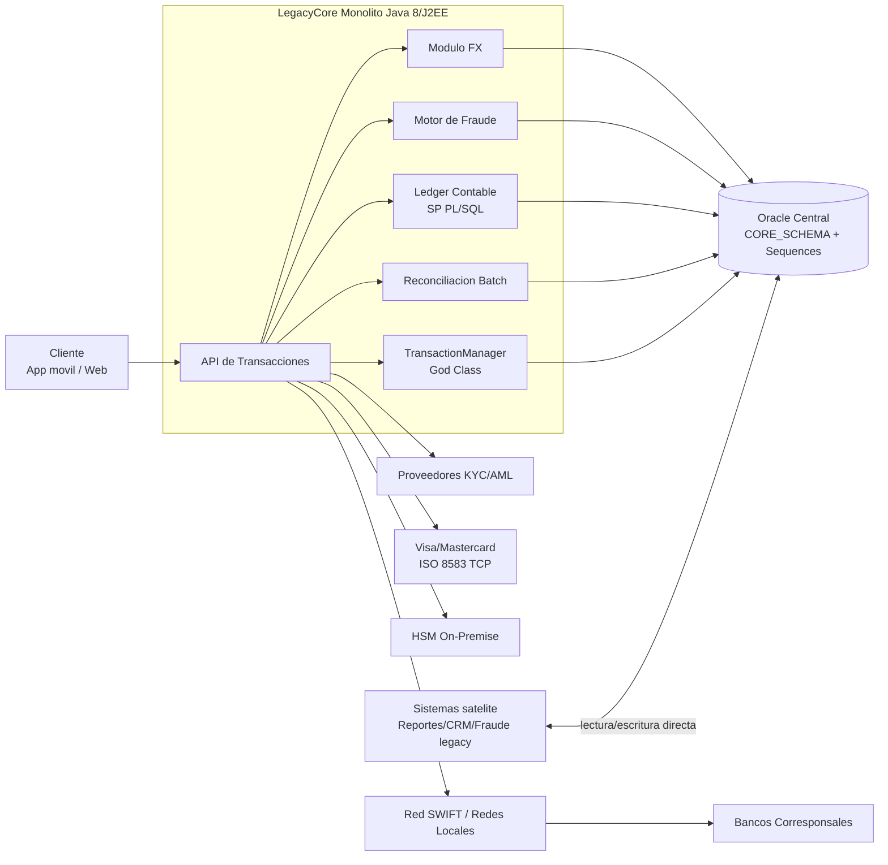
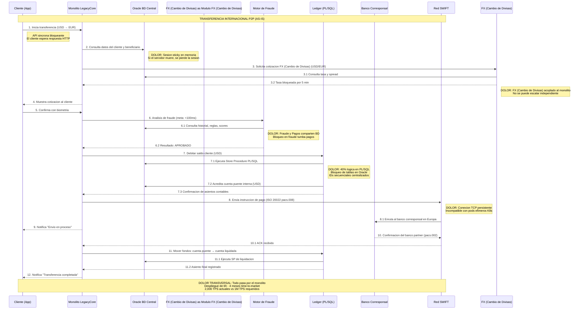
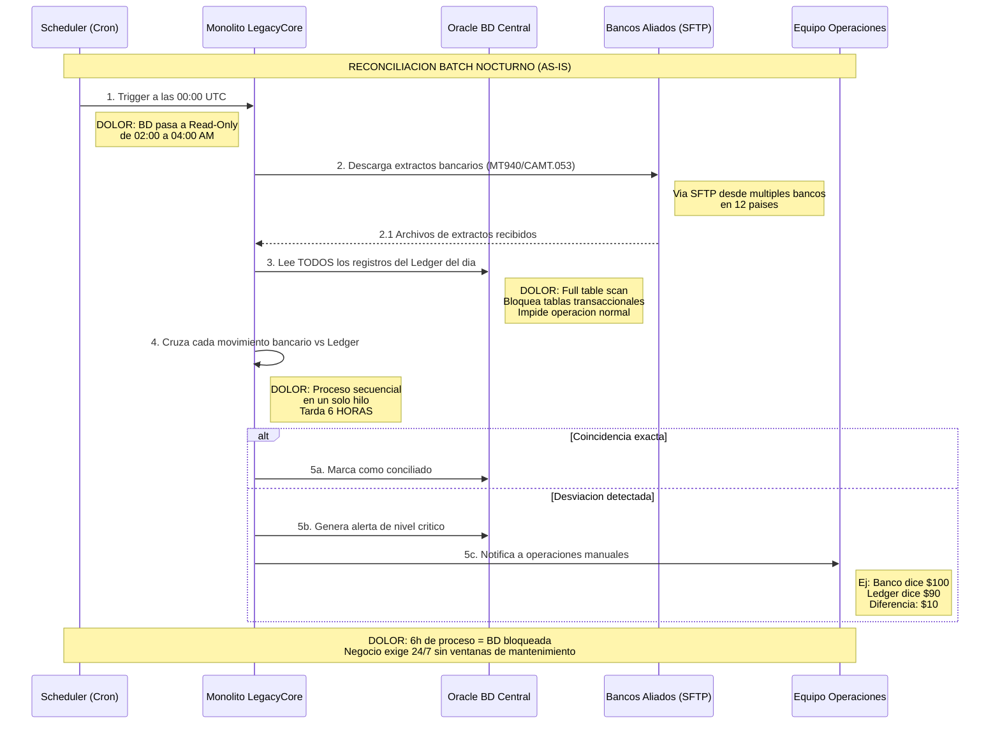
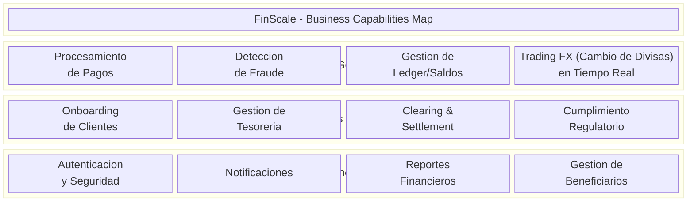

# Etapa 1: Definicion del Reto y Entendimiento del Negocio

---

## 1.1 Contexto del negocio

FinScale es una fintech con 15 anos de operacion, presencia en 12 paises y una plataforma
heredada centralizada (`LegacyCore`) sobre Java 8/J2EE + Oracle. El negocio necesita evolucionar
hacia `GlobalLedger` para escalar de 2,000 **TPS** a picos de 1,000,000 **TPS**, operar 24/7 y
reducir el **time-to-market** de 4 meses sin detener la operacion actual.

En terminos ejecutivos:

- **TPS** significa transacciones por segundo; mide cuantas operaciones puede procesar la plataforma.
- **Legacy** o sistema heredado significa que el sistema actual sigue siendo critico, pero su tecnologia y diseno limitan el crecimiento.
- **Time-to-market** es el tiempo que tarda una idea de negocio en llegar a produccion.
- **24/7** significa operacion continua, sin ventanas de mantenimiento que bloqueen a los clientes.

### Diagrama de componentes del sistema actual (AS-IS)



### Puntos de dolor principales (resumen ejecutivo)

| Dolor | Descripcion breve | Impacto |
|---|---|---|
| Monolito acoplado | Todo pasa por `LegacyCore`; no hay despliegue ni escalado por modulo | Time-to-market lento y alto riesgo de regresion |
| Oracle como cuello de botella | Base de datos compartida, bloqueos frecuentes y 40% de logica en PL/SQL | Caida de rendimiento y alta complejidad de migracion |
| Fragilidad operativa | Batch nocturno (proceso masivo programado) y ventanas de mantenimiento de 6 horas | Imposible cumplir operacion 24/7 |
| Integraciones legacy stateful | ISO 8583 TCP persistente + dependencias HSM on-premise | Dificulta adopcion cloud native y elasticidad |
| Acoplamiento con satelites por BD | Sistemas externos dependen del esquema interno | Cambios de datos rompen integraciones no controladas |
| Escalabilidad insuficiente | Arquitectura sincrona bloqueante y sesiones sticky | No soporta objetivo de 1M TPS |

---

## 1.2 Domain Storytelling: Transferencia Internacional P2P

A continuacion se presentan dos historias: el flujo actual (AS-IS) con sus dolores, y el
flujo critico de reconciliacion.

---

### Historia 1: Transferencia Internacional P2P — "El Camino Feliz" (AS-IS)

**Narrativa**: Un cliente en EE.UU. quiere enviar USD a un beneficiario en Europa (EUR)
a traves de la app movil de FinScale.

#### Actores
| Actor | Tipo | Sistema |
|-------|------|---------|
| Cliente | Persona | App Movil/Web |
| LegacyCore (Monolito) | Sistema interno | Java 8 / J2EE |
| Base de Datos Oracle | Infraestructura | Oracle centralizada |
| Motor de Fraude | Modulo interno | Dentro del monolito |
| Ledger (Contabilidad) | Modulo interno | PL/SQL en Oracle |
| Modulo FX (Cambio de Divisas) | Modulo interno | Dentro del monolito |
| Banco Corresponsal | Sistema externo | JP Morgan / Citi / BBVA |
| Red SWIFT | Red externa | Mensajeria ISO 20022 |

#### Diagrama de Secuencia (AS-IS con puntos de dolor)



#### Puntos de Dolor Identificados (resumen)

| # | Punto de Dolor | Impacto en Negocio | Componente Afectado |
|---|---------------|-------------------|-------------------|
| D1 | API sincrona bloqueante | No soporta 1M TPS, cliente espera | App → Monolito |
| D2 | Sesiones sticky en memoria | No escala horizontalmente, perdida de sesion si server muere | Monolito |
| D3 | FX (Cambio de Divisas) acoplado al monolito | No escala independiente, deploy conjunto | Modulo FX (Cambio de Divisas) |
| D4 | Fraude comparte BD con Pagos | Bloqueo en fraude tumba pagos | Motor Fraude + Oracle |
| D5 | 40% logica en PL/SQL | Imposible extraer a microservicios sin reescribir | Ledger / Oracle |
| D6 | IDs secuenciales centralizados | Cuello de botella, punto unico de fallo | Oracle Sequences |
| D7 | Conexiones TCP persistentes (ISO 8583) | Incompatible con contenedores efimeros | Red de tarjetas |
| D8 | Monolito como unico punto de paso | Fallo total si cae, deploy monolitico | Toda la plataforma |
| D9 | God Class TransactionManager (15K lineas) | Acoplamiento ciclico, imposible deploy parcial | Codigo Java |

---

### Historia 2: Reconciliacion Batch Nocturno — "El Dolor de Cabeza" (AS-IS)

**Narrativa**: Cada noche a las 00:00 UTC, el equipo de System of Record ejecuta la
reconciliacion entre el Ledger interno y los extractos de los bancos aliados.



#### Dolores Especificos de la Reconciliacion

| # | Dolor | Causa Raiz | Impacto |
|---|-------|-----------|---------|
| R1 | Proceso tarda 6 horas | Secuencial, single-thread, full table scan | BD bloqueada toda la madrugada |
| R2 | BD en Read-Only (02:00-04:00) | Requiere consistencia durante el cruce | Clientes no pueden operar 24/7 |
| R3 | Bloqueo de tablas transaccionales | Queries masivos sobre tabla principal | Afecta cualquier operacion nocturna |
| R4 | Sin paralelismo | Monolito no soporta procesamiento distribuido | No escala con mas bancos/paises |

---

## 1.3 Drivers de Arquitectura


### 1.3.1 Proposito de Diseño

Diseñar la arquitectura de "GlobalLedger", la nueva plataforma de gestion financiera global
de FinScale, que permita:
- Procesar pagos internacionales en tiempo real con deteccion de fraude
- Escalar de 2,000 a 1,000,000 TPS
- Operar 24/7 en 12 paises sin ventanas de mantenimiento
- Migrar desde el monolito LegacyCore sin detener la operacion

### 1.3.2 Requerimientos Funcionales Arquitectonicamente Significativos

Estos son los requerimientos que tienen mayor impacto en las decisiones de arquitectura:

| ID | Requerimiento | Por que es significativo | Equipo Owner |
|----|--------------|------------------------|-------------|
| RF-01 | Procesar transferencias internacionales P2P con conversion FX (Cambio de Divisas) en tiempo real | Involucra orquestacion de multiples subdominios (FX (Cambio de Divisas), Fraude, Ledger, Clearing) | Global Operations |
| RF-02 | Deteccion de fraude en < 100ms por transaccion | Requiere arquitectura de baja latencia; puede responder en linea, pero no debe depender de consultas lentas o bloqueantes | Trust & Safety |
| RF-03 | Registro inmutable de doble entrada en el Ledger | Requiere consistencia fuerte (ACID) en saldos, define patron de datos | System of Record |
| RF-04 | Reconciliacion automatica sin bloquear operacion | Eliminar la ventana batch nocturna, requiere CQRS o procesamiento stream | System of Record |
| RF-05 | Onboarding con verificacion KYC asincrona | Integracion asincrona con proveedores externos (webhooks), define patron de integracion | Growth & CX |
| RF-06 | Screening contra listas de sanciones (OFAC, PEP) en cada transaccion | Punto de validacion obligatorio en el pipeline de pagos, afecta latencia | Trust & Safety |
| RF-07 | Dispersion masiva: 500K pagos batch a 50 paises | Requiere procesamiento batch masivo paralelo, patrones de memoria (Flyweight) | Global Operations |
| RF-08 | Clearing & Settlement via multiples redes (SWIFT, SEPA, ACH, PIX) | Multiples protocolos y patrones de integracion, algunos legacy (ISO 8583 TCP) | Global Operations |

### 1.3.3 Atributos de Calidad y Escenarios

| ID | Atributo | Escenario | Estimulo | Respuesta Esperada | Metrica |
|----|----------|-----------|----------|-------------------|---------|
| QA-01 | **Escalabilidad** | Evento masivo de mercadeo genera pico de transacciones | Carga sube de 2K a 1M TPS en minutos | El sistema escala automaticamente sin degradacion | Tiempo de auto-scale < 2 min, 0% de transacciones perdidas |
| QA-02 | **Disponibilidad** | Fallo catastrofico en el modulo de Fraude | Nodo de fraude se cae completamente | El procesamiento no se detiene: pagos de bajo riesgo pueden quedar en cola o en estado `PENDING_REVIEW`; pagos de alto riesgo se bloquean hasta recuperar control | Uptime 99.999% = max 5.26 min downtime/año |
| QA-03 | **Rendimiento** | Cliente inicia una transferencia internacional | Request HTTP llega al sistema | Respuesta al cliente en < 2 segundos (confirmacion de recepcion) | Latencia p99 < 2s end-to-end |
| QA-04 | **Rendimiento** | Motor de fraude evalua una transaccion | Transaccion entra al pipeline de fraude | Veredicto emitido | Latencia p99 < 100ms |
| QA-05 | **Resiliencia** | Red SWIFT no disponible temporalmente | Timeout en conexion SWIFT | Sistema encola el pago y reintenta automaticamente al restaurarse | 0 pagos perdidos, reintento automatico < 5 min |
| QA-06 | **Consistencia** | Dos transacciones concurrentes sobre el mismo saldo | Debitos simultaneos al mismo cliente | Saldo nunca queda negativo, consistencia fuerte ACID en el Ledger | 0 inconsistencias de saldo |
| QA-07 | **Consistencia Eventual** | Pago procesado debe reflejarse en reportes y notificaciones | Pago completado en el Ledger | Reportes y notificaciones reflejan el pago | Propagacion < 5 segundos |
| QA-08 | **Seguridad** | Auditoria de cumplimiento PCI-DSS y GDPR | Auditor solicita trazabilidad de una transaccion | Sistema provee traza completa: origen, ruta, timestamps, responsables | 100% de transacciones trazables |
| QA-09 | **Desplegabilidad** | Se necesita actualizar el modulo de FX (Cambio de Divisas) sin afectar Pagos | Deploy de nueva version de FX (Cambio de Divisas) | Deploy independiente sin downtime ni afectacion a otros modulos | Deploy en < 15 min, 0 downtime |
| QA-10 | **Modificabilidad** | Nuevo pais requiere integracion con red de pago local | Agregar soporte para nueva red (ej. PIX Brasil) | Se integra sin modificar el core de pagos | Tiempo de integracion < 2 semanas |

**Ejemplo simple de lectura de un atributo de calidad**

Si la red SWIFT no responde durante 3 minutos, el cliente no debe perder su pago ni recibir una confirmacion falsa. La plataforma registra la intencion, devuelve un estado `PENDING`, reintenta de forma controlada y permite consultar el mismo `correlationId` hasta que la red confirme o rechace la operacion.

### 1.3.4 Architectural Concerns

Preocupaciones transversales que los stakeholders han expresado:

| ID | Concern | Stakeholder | Descripcion |
|----|---------|-------------|-------------|
| AC-01 | Migracion sin interrupcion | CEO / CTO | El negocio mueve millones diarios. NO se puede parar para migrar. |
| AC-02 | Coexistencia legacy-moderno | CTO / Equipos Dev | Durante la migracion, el monolito y los nuevos servicios deben coexistir y compartir datos. |
| AC-03 | Retencion de talento | VP Engineering | El equipo actual conoce Java 8/J2EE. La migracion a Spring Boot 4 + Virtual Threads reduce la curva de aprendizaje frente a un modelo totalmente reactivo. |
| AC-04 | Costo de infraestructura | CFO | Escalar a 1M TPS en cloud puede ser costoso. Necesitamos auto-scaling inteligente. |
| AC-05 | Observabilidad | SRE / Ops | En un sistema distribuido, el trazado y monitoreo de punta a punta son criticos para saber que paso con cada pago. |
| AC-06 | Consistencia de datos en migracion | DBA / Arquitecto | Mientras coexisten legacy y moderno, los datos deben estar sincronizados (Golden Record). |

### 1.3.5 Restricciones

**Restricciones Tecnicas:**

| ID | Restriccion | Origen | Impacto en Diseño |
|----|------------|--------|------------------|
| RT-01 | Stack objetivo: Java 25 + Spring Boot 4 (Spring Web MVC + Virtual Threads) | Objetivo estrategico de la empresa | Define lenguaje, framework y modelo de concurrencia para alta escalabilidad sin complejidad reactiva extrema |
| RT-02 | HSMs fisicos on-premise para criptografia | Regulacion PCI-DSS + inversion existente | Arquitectura hibrida (cloud + on-premise) o migracion a Cloud HSM |
| RT-03 | Conexion ISO 8583 sobre TCP con Visa/Mastercard | Protocolo impuesto por las redes de tarjetas | Necesita sidecar/proxy dedicado para manejar conexiones stateful |
| RT-04 | Integraciones legacy variadas por pais (SFTP, SOAP, REST) | Redes locales de cada pais | Patron adaptador/anti-corruption layer por integracion |
| RT-05 | Latencia < 200ms para autorizaciones con tarjetas | SLA con Visa/Mastercard | Componente de autorizacion debe estar geograficamente cerca |

### 1.3.6 Decision tecnica: Spring Web + Virtual Threads vs WebFlux

Se prioriza **Spring Web MVC con Virtual Threads (Java 25)** como stack principal para
la modernizacion inicial de FinScale, manteniendo arquitectura event-driven para
desacoplamiento entre dominios.

| Criterio | Spring WebFlux | Spring Web + Virtual Threads | Decision para FinScale |
|---|---|---|---|
| Curva de aprendizaje del equipo | Alta (modelo reactivo end-to-end, backpressure, operadores) | Media-baja (modelo imperativo conocido) | **Gana Virtual Threads** por adopcion mas rapida |
| Compatibilidad con dependencias legacy | Requiere aislar llamadas bloqueantes o adaptarlas | Soporta naturalmente I/O bloqueante en hilos livianos | **Gana Virtual Threads** por menor friccion |
| Time-to-market de migracion | Riesgo de sobre-esfuerzo por refactor profundo | Migracion incremental con menor cambio mental | **Gana Virtual Threads** |
| Observabilidad y debugging | Mas complejo en flujos reactivos extensos | Trazas y debugging similares al modelo actual | **Gana Virtual Threads** |
| Escalabilidad I/O bound | Muy alta | Alta (con hilos livianos y tuning correcto) | **Empate practico** para objetivos iniciales |
| Riesgo de implementacion | Mayor (errores de programacion reactiva) | Menor (patrones conocidos) | **Gana Virtual Threads** |

**Por que es mejor opcion en este contexto**
- FinScale parte de un monolito Java 8 con fuerte presencia de integraciones bloqueantes (Oracle,
  HSM on-prem, ISO 8583 TCP, conectores legacy por pais).
- Virtual Threads permite escalar concurrencia sin obligar una reescritura completa a paradigma
  reactivo en la primera fase del Strangler.
- Reduce el riesgo de entrega y acelera la captura de valor de negocio (menos tiempo de capacitacion
  y menor complejidad operativa inicial).
- Permite evolucionar por etapas: primero desacoplar dominios y datos; luego optimizar hot paths
  especificos donde reactive/non-blocking aporte ventajas claras.

**Restricciones de Negocio:**

| ID | Restriccion | Origen | Impacto en Diseño |
|----|------------|--------|------------------|
| RN-01 | Cumplimiento PCI-DSS | Regulacion industria de pagos | Segmentacion de red, cifrado, tokenizacion de datos sensibles |
| RN-02 | Cumplimiento GDPR | Regulacion europea (opera en 12 paises) | Derecho al olvido, consentimiento, residencia de datos por region |
| RN-03 | Operacion 24/7 sin ventanas de mantenimiento | Expectativa de negocio global | Zero-downtime deployments, eliminacion de batch bloqueante |
| RN-04 | Disponibilidad 99.999% | SLA comprometido | Multi-region, failover automatico, sin single point of failure |
| RN-05 | Migracion gradual (no Big Bang) | Riesgo operacional | Patron Strangler Application, coexistencia legacy + moderno |

---

## 1.4 Business Capabilities Map (TOGAF)


### Mapa de Capacidades de Negocio



### Clasificacion Detallada

| Capacidad de Negocio | Nivel | Accion | Justificacion |
|---------------------|-------|--------|---------------|
| **Procesamiento de Pagos** | Core | TRANSFORMAR | Es el corazon del negocio. Hoy esta atrapado en el monolito con PL/SQL. Debe extraerse y escalar a 1M TPS. Es lo que genera ingresos directos. |
| **Deteccion de Fraude** | Core | TRANSFORMAR | Diferenciador competitivo critico. Hoy esta acoplado y tumba pagos. Debe ser independiente, en tiempo real (<100ms), y con ML. Protege ingresos y reputacion. |
| **Gestion de Ledger/Saldos** | Core | TRANSFORMAR | Es la "verdad financiera". Hoy es PL/SQL en Oracle con bloqueos. Debe migrarse a un servicio inmutable de doble entrada con consistencia ACID, pero desacoplado del monolito. |
| **Trading FX (Cambio de Divisas) en Tiempo Real** | Core | TRANSFORMAR | Diferenciador para pagos internacionales. Cotizacion y bloqueo de tasa en tiempo real. Hoy acoplado al monolito, debe escalar independientemente. |
| **Onboarding de Clientes** | Soporte | OPTIMIZAR | Importante pero no diferenciador. Puede mejorar su flujo con KYC asincrono. La verificacion biometrica ya usa proveedores externos (Jumio, Onfido). |
| **Gestion de Tesoreria** | Soporte | OPTIMIZAR | Monitoreo de liquidez en bancos partner. Es critico pero es mayormente monitoreo y alertas. Necesita datos en tiempo real del Ledger pero no requiere reescritura completa. |
| **Clearing & Settlement** | Soporte | TRANSFORMAR | Integracion con multiples redes (SWIFT, SEPA, ACH, PIX). Hoy tiene conexiones legacy TCP. Necesita adaptadores modernos pero la logica de liquidacion es relativamente estandar. |
| **Cumplimiento Regulatorio** | Soporte | OPTIMIZAR | Sanctions screening, GDPR, PCI-DSS. Es obligatorio pero no diferenciador. Se puede optimizar con mejores datos y automatizacion de reportes. Listas negras y reglas se pueden externalizar parcialmente. |
| **Autenticacion y Seguridad** | Generico | OPTIMIZAR | OAuth2, 2FA, manejo de sesiones. Es generico. Soluciones de mercado existen (Keycloak, Auth0). Externalizar sesiones a Redis es suficiente. |
| **Notificaciones** | Generico | OPTIMIZAR | Push, email, SMS. No es diferenciador. Se puede usar un servicio de notificaciones generico. Solo necesita consistencia eventual con el Ledger. |
| **Reportes Financieros** | Generico | OPTIMIZAR | Reportes regulatorios y operativos. Puede usar CQRS con vistas materializadas. No requiere tiempo real, consistencia eventual es aceptable. |
| **Gestion de Beneficiarios** | Generico | OPTIMIZAR | CRUD de terceros frecuentes. Funcionalidad simple. Solo necesita migrarse fuera del monolito como parte del bounded context de clientes. |

### Matriz de Priorizacion Estrategica

```
                    ALTO VALOR ESTRATEGICO
                           |
    TRANSFORMAR            |           TRANSFORMAR
    (Inversion fuerte)     |           (Inversion fuerte)
                           |
    - Procesamiento Pagos  |  - Deteccion Fraude
    - Ledger/Saldos        |  - Trading FX (Cambio de Divisas)
    - Clearing & Settlement|
                           |
    ───────────────────────┼───────────────────────
                           |
    OPTIMIZAR              |           OPTIMIZAR
    (Mejora incremental)   |           (Mejora incremental)
                           |
    - Tesoreria            |  - Onboarding
    - Cumplimiento         |  - Autenticacion
                           |  - Notificaciones
                           |  - Reportes
                           |  - Beneficiarios
                           |
                    BAJO VALOR ESTRATEGICO

    ALTA COMPLEJIDAD  ←──────────────→  BAJA COMPLEJIDAD
```

### KPIs de Negocio vs Metricas Tecnicas

Para medir el exito de la transformacion:

| Objetivo Estrategico | Driver de Arquitectura | KPI de Negocio | Metrica Tecnica |
|---------------------|----------------------|---------------|----------------|
| Escalabilidad Extrema | Arquitectura desacoplada + Virtual Threads + auto-scaling | Soportar eventos de 1M TPS sin perdida de transacciones | Throughput p99, tiempo de auto-scale, % packet loss |
| Disponibilidad 99.999% | Multi-region + failover + desacoplamiento | < 5.26 min downtime al año | Uptime %, MTTR, numero de incidentes P1 |
| Modernizacion a Cloud Native | Spring Boot 4 (Spring Web + Virtual Threads) + Kubernetes + Event-Driven | Time-to-market de 4 meses a 2 semanas | Lead time for changes, deployment frequency |
| Gobierno de Datos (PCI-DSS/GDPR) | Trazabilidad total + cifrado + tokenizacion | 0 hallazgos criticos en auditoria | % transacciones trazables, cobertura de cifrado |
| Resiliencia | Circuit breaker + bulkhead + colas de reintento | Fallo en fraude no afecta pagos | Blast radius por fallo, tiempo de recuperacion |
| Eliminacion batch nocturno | CQRS + Event Streaming para reconciliacion | Operacion 24/7 sin ventanas | Horas de indisponibilidad por mantenimiento |
