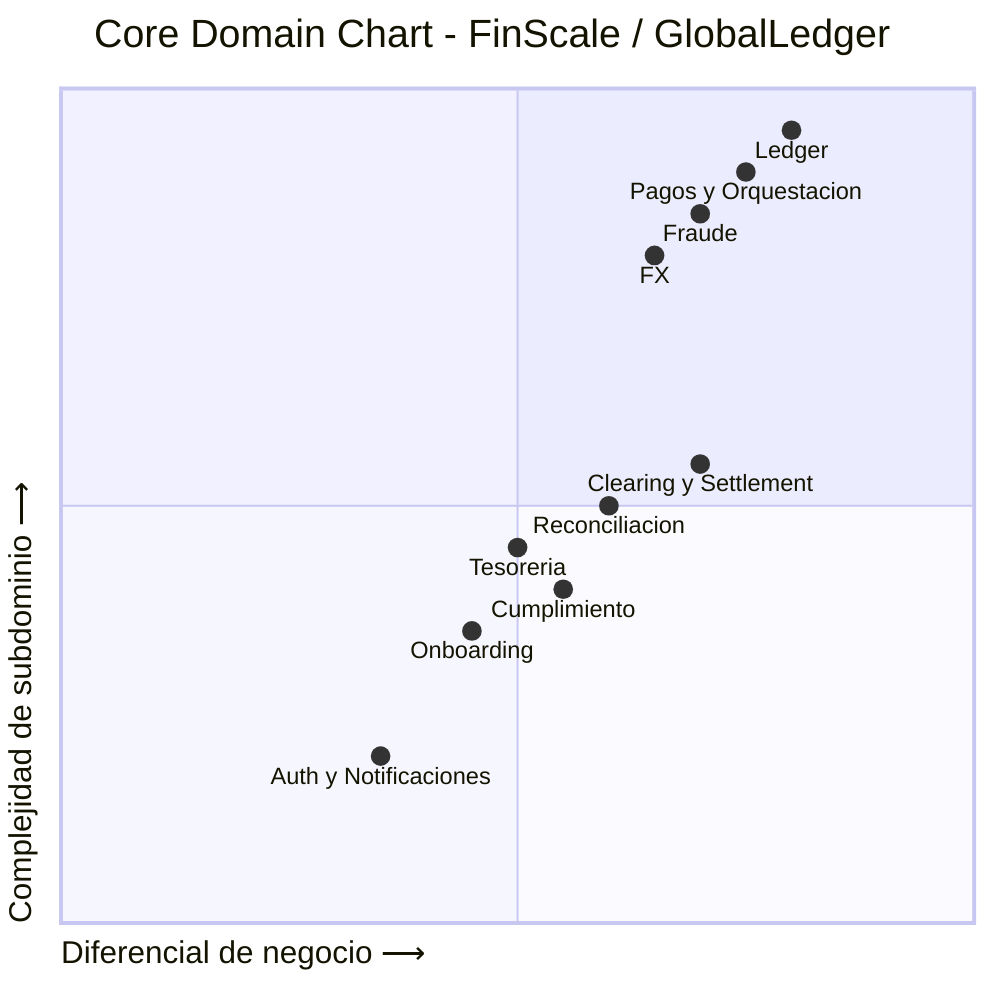
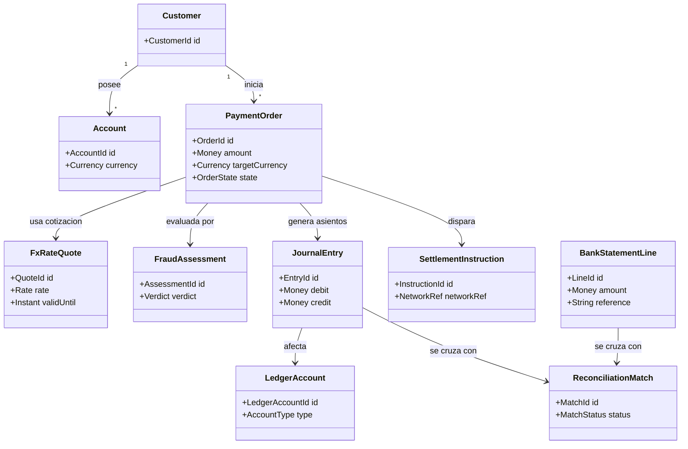
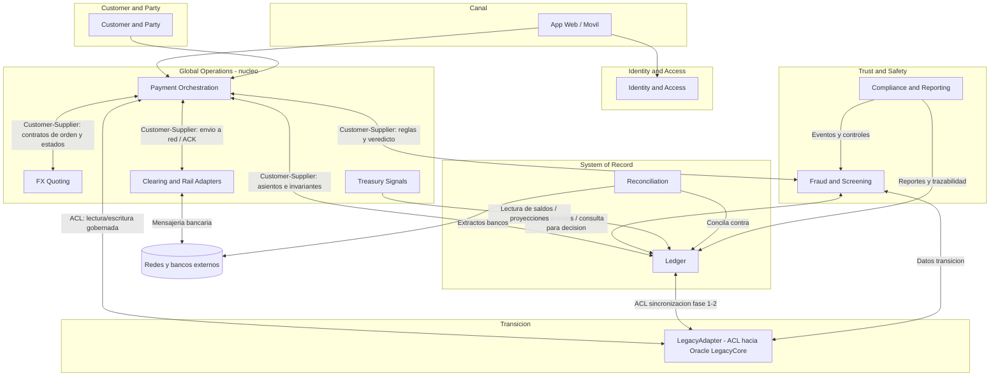

# Etapa 2: Diseno Estrategico (DDD)

---

Esta etapa traduce el negocio a fronteras de responsabilidad. **DDD** significa *Domain-Driven Design* o diseno guiado por dominio: organizar el software alrededor de las capacidades reales del negocio, no alrededor de tablas o capas tecnicas. Un **bounded context** es una frontera donde un equipo puede usar su propio lenguaje, reglas y datos sin depender de una base de datos compartida.

La idea central para gerencia es simple: si Pagos, Ledger, Fraude y FX cambian por razones distintas, tambien deben poder evolucionar y desplegarse con independencia controlada.

## 2.1 Core Domain Chart

| Subdominio | Tipo | Justificacion |
|------------|------|---------------|
| **Procesamiento y orquestacion de pagos** (ordenes, enrutamiento, idempotencia) | **Core** | Esta en **Core** porque concentra el diferencial competitivo principal de FinScale en ejecucion y resiliencia del flujo de dinero (ordenes de pago, enrutamiento inteligente, idempotencia y orquestacion de extremo a extremo). |
| **Ledger (contabilidad tecnica, doble entrada, verdad financiera)** | **Core** | Esta en **Core** porque define la confianza financiera del producto y la correccion de cada movimiento monetario (doble entrada, invariantes de saldo, inmutabilidad y trazabilidad contable). |
| **Deteccion de fraude y riesgo en tiempo real** | **Core** | Esta en **Core** porque protege ingresos en tiempo real y habilita una experiencia segura con baja friccion como diferenciador de mercado (scoring transaccional, decision en linea <100ms y controles de riesgo acoplados al pago). |
| **FX (Cambio de Divisas) - cotizacion y bloqueo** | **Core** | Esta en **Core** porque impacta directamente margen y experiencia en pagos internacionales, donde FinScale compite por velocidad y precision de tasa (cotizacion, lock de tipo de cambio y reglas comerciales por corredor). |
| **Clearing (Reconciliación) y settlement con redes y bancos** | **Soporte (estratégico a transformar)** | Esta en **Soporte** porque es critico para operar pero su complejidad principal es de integracion con terceros, no de logica diferencial propia (adaptadores por red/pais, mensajeria bancaria y confirmacion de settlement). |
| **Reconciliacion contable (extractos vs ledger)** | **Soporte** | Esta en **Soporte** porque asegura continuidad operativa y control, aunque no es donde se crea el mayor diferencial de mercado (matching extractos vs ledger, gestion de excepciones y cierre diario sin bloqueo). |
| **Cumplimiento y reporting regulatorio** | **Soporte** | Esta en **Soporte** porque es obligatorio para operar en cada jurisdiccion y se optimiza por calidad de datos y proceso (reportes regulatorios, trazabilidad para auditoria y controles de cumplimiento). |
| **Tesoreria y liquidez** | **Soporte** | Esta en **Soporte** porque habilita decisiones financieras operativas sobre datos ya consolidados del core (monitoreo de posiciones, alertas de liquidez y proyecciones de fondeo). |
| **Onboarding y datos de parte (KYC, party data)** | **Soporte** | Esta en **Soporte** porque es necesario para habilitar clientes y cumplimiento, pero suele apalancarse en proveedores especializados (KYC/KYB, validacion documental y gestion de datos de parte). |
| **Autenticacion, notificaciones, reportes operativos** | **Generico** | Esta en **Generico** porque son capacidades commodity disponibles en plataformas estandar y no aportan diferenciacion directa al negocio (login/MFA, envio de notificaciones y reporteria operativa basica). |

---

## 2.2 Modelo de dominio (vista conceptual)

Modelo de **dominio** con sus respectivas entidades y asociaciones principales
que sustentan los dos procesos criticos de FinScale (P2P internacional y reconciliacion).

**Nota de diseno**: Entre contextos, las referencias cruzadas se materializan como **IDs de
correlacion** (pago, ledger, settlement) y contratos de API/evento, no como FKs compartidas.

### Ejemplo:

**Proceso 1: P2P internacional (de orden a liquidacion)**

1. Se crea la orden de pago:

   `PaymentOrder`:
   - `id`: `PO-1001`
   - `amount`: `100 USD`
   - `targetCurrency`: `MXN`
   - `state`: `CREATED`

2. Se consulta y bloquea tipo de cambio:

   `FxRateQuote`:
   - `id`: `FXQ-501`
   - `rate`: `17.20`
   - `validUntil`: `2026-04-24T10:00:30Z`

3. Se evalua riesgo/fraude:

   `FraudAssessment`:
   - `id`: `FR-900`
   - `verdict`: `APPROVED`

4. Se registra el impacto contable interno:

   `JournalEntry`:
   - `id`: `JE-7001`
   - `debit`: `Cuenta cliente origen - 100 USD`
   - `credit`: `Cuenta puente/liquidacion - 100 USD`

5. Se emite instruccion operativa a la red:

   `SettlementInstruction`:
   - `id`: `SI-3001`
   - `networkRef`: `SWIFT-ABC-7788`
   - `status`: `SENT`

**Lectura del modelo**:
- `JournalEntry` representa la **verdad contable interna** (que impacto financiero se registra).
- `SettlementInstruction` representa la **ejecucion externa** (como se liquida en la red).

**Proceso 2: Reconciliacion (extracto vs ledger)**

1. Ingresa una linea de extracto bancario:

   `BankStatementLine`:
   - `id`: `BSL-8801`
   - `amount`: `100 USD`
   - `reference`: `SWIFT-ABC-7788`

2. Reconciliation busca el asiento contable relacionado:

   `JournalEntry` (buscado):
   - `id`: `JE-7001`
   - `debit`: `Cuenta cliente origen - 100 USD`
   - `credit`: `Cuenta puente/liquidacion - 100 USD`

3. Se crea resultado de cruce:

   `ReconciliationMatch`:
   - `id`: `RM-4501`
   - `status`: `MATCHED`
   - `matchedBy`: `reference + amount`

4. Si no coincide monto, referencia o timing, `ReconciliationMatch.status` pasa a `EXCEPTION`
   para gestion operativa.

---

## 2.3 Bounded Contexts (propuesta)

Cada contexto tiene un **ciclo de vida** de despliegue propio, alineado
a los equipos de negocio y a la extraccion gradual del monolito (`Strangler`). En otras palabras: un cambio en reglas de fraude no deberia obligar a desplegar de nuevo el ledger contable, y una mejora en FX no deberia poner en riesgo las APIs de beneficiarios.

| Bounded Context | Responsabilidad principal | Equipo alineado (kata) |
|-----------------|----------------------------|-------------------------|
| **Identity & Access** | Autenticacion, sesion (externa a memoria de app), device binding. | Growth & CX |
| **Customer & Party** | Perfil, beneficiarios, datos fiscales y datos de parte (party data). | Growth & CX |
| **Payment Orchestration** | Orden de pago, saga/orquestacion, idempotencia, enrutamiento a FX/Ledger/Clearing. | Global Operations |
| **FX Quoting** | Pares, spread, bloqueo de tasa, reglas comerciales. | Global Operations |
| **Fraud & Screening** | Fraude en tiempo real, listas, decision engine; screening OFAC/PEP. | Trust & Safety |
| **Ledger (System of Record financiero)** | Cuentas contables, asientos, invariantes de saldo, doble entrada. | System of Record |
| **Clearing & Rail Adapters** | Abstraccion por red: SWIFT ISO 20022, SEPA, ACH, PIX, ISO 8583 via adaptadores. | Global Operations |
| **Reconciliation** | Ingesta de extractos (MT940/CAMT), cruce, alertas, cuadre con ledger. | System of Record + Ops |
| **Treasury Signals** | Liquidez y posiciones (lectura/alerts); no duplica verdad contable. | Global Operations |
| **Compliance & Reporting** | Reportes regulatorios, ROS, trazas para auditoria. | Trust & Safety + Legal |

**Contexto de transicion (no es dominio puro de producto)**: **LegacyAdapter / Anti-Corruption**
entre nuevos servicios y `CORE_SCHEMA` Oracle, hasta que el trafico y el Golden Record migren
por fases.

---

## 2.4 Context Map (Mapa de contexto)

Relaciones DDD principales. La orquestacion de pago actua como **orquesta**; **Ledger** y
**Fraud** son proveedores internos con contratos estrictos; hacia el legado se aplica **ACL**
(*Anti-Corruption Layer*, capa anticorrupcion) para no contaminar el nuevo modelo con tablas y
procedimientos almacenados heredados.

| Relacion | Tipo DDD (patron) | Comentario |
|----------|-------------------|------------|
| Payment Orchestration → FX Quoting | **Customer-Supplier** | El orchestrator "compra" cotizacion; FX publica en lenguaje estable (API/eventos). |
| Payment Orchestration → Fraud & Screening | **Customer-Supplier** | Fraude ofrece un contrato de decision (<100ms). |
| Payment Orchestration → Ledger | **Customer-Supplier** | El ledger impone reglas de contabilidad; el pago no compromete asientos directamente. |
| Clearing → Redes bancarias / esquemas | **Conformist** (donde no hay eleccion) | Se adapta a ISO 20022, formatos y SLAs ajenos. |
| Cualquier contexto → Legacy + Oracle | **Anti-Corruption Layer** | Traduce CORE_SCHEMA, SPs y modelos viejos al lenguaje del contexto. |

**Nota de riesgo arquitectonico (estado actual heredado):**
Hoy existen integraciones y modulos legacy "satelite" acoplados a `CORE_SCHEMA` que representan un riesgo tipo **Big Ball of Mud**.
Estrategia de mitigacion: vistas de compatibilidad, APIs gobernadas y `ACL` por contexto para
reducir acoplamiento progresivamente.

**Ejemplo simple**

Si Pagos necesita saber si una transferencia puede continuar, no consulta directamente tablas de fraude ni tablas Oracle. Pide un veredicto a `Fraud & Screening` mediante un contrato claro. Si el dato viene del legado, solo el `LegacyAdapter` conoce la tabla o el procedimiento almacenado; Pagos recibe una respuesta limpia como `APPROVED`, `REJECTED` o `PENDING_REVIEW`.

---

## 2.5 Organizacion de equipos (Ley de Conway inversa)

Alineamos **estructura de entrega** con **bounded contexts** para reducir acoplamiento, duplicar
minimos de modelo y acelerar ownership.

| Equipo (recomendacion) | Mision | Contextos bajo su ownership |
|------------------------|--------|----------------------------|
| **Platform Experience** | Canales, identidad, datos de cliente y party. | Identity & Access, Customer & Party. |
| **Global Payments** | Orquestar el flujo de pago, FX, clearing y conectividad a redes. | Payment Orchestration, FX Quoting, Clearing & Rail Adapters, Treasury Signals. |
| **Trust** | Riesgo en tiempo real y compliance operativo. | Fraud & Screening, Compliance & Reporting. |
| **Ledger & Truth** | Verdad financiera y cierre; reconciliacion sin bloqueo. | Ledger, Reconciliation. |
| **Core Platform** | Plataforma compartida: event bus, observabilidad, estandares, ACL comun al legado, seguridad. | Travesia transversal: patrones, no duplicar dominio. |

**Principios**:
- Cada flujo de valor P2P tiene un **dueño** en **Global Payments** que prioriza el backlog
  con **Ledger** y **Trust**.
- **Conway inversa** implica: primero fijar contextos y interfaces; luego, si hace falta, ajustar
  reporting lines para evitar "equipo monolito" o duplicar motor de pago/ledger.
- Reuniones de alineacion **triada** frecuente: Payments, Ledger, Trust (drivers compartidos:
  latencia, resiliencia, consistencia de saldo).

---

## 2.6 Notas

- Los **contextos** anteriores son el mapa base para: diagramas C4, definicion de contenedores
  (servicios, colas, API Gateway), y para la estrategia de **consistencia** (SAGA, outbox, event
  sourcing donde aplique) en el diseno tecnico.
- **LegacyAdapter** vive mientras dure el Strangler: su objetivo es desaparecer o reducirse a
  conectores aislados por fase, no a perpetuar integracion por DB compartida en el producto
  target.
