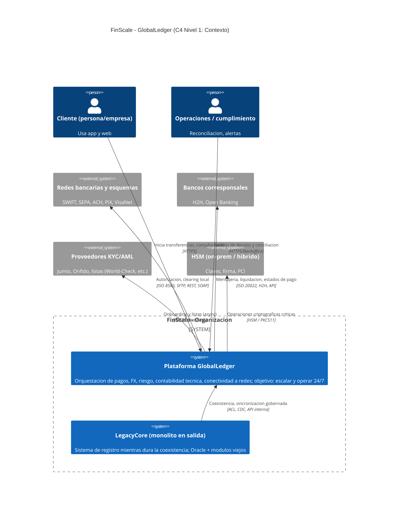
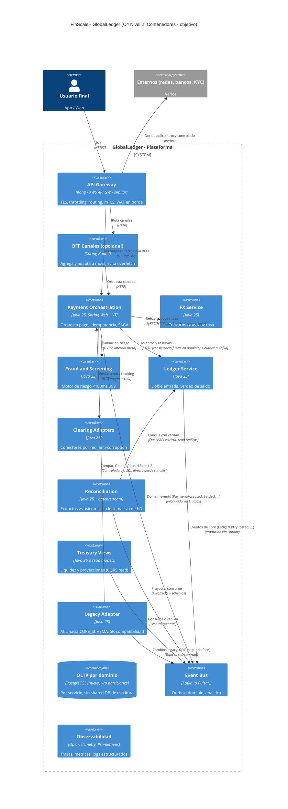
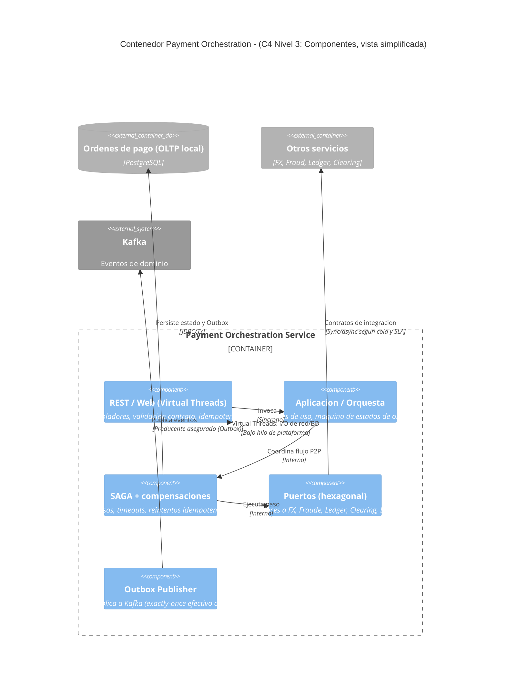
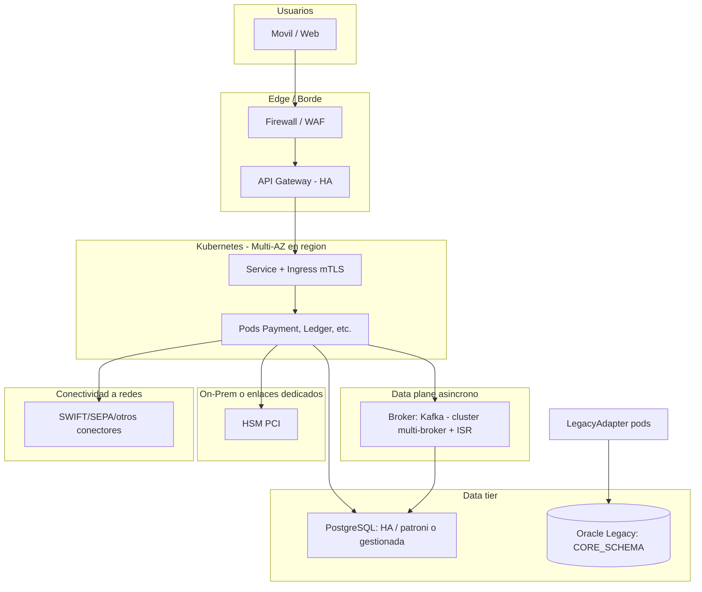
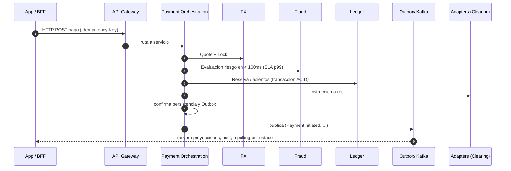
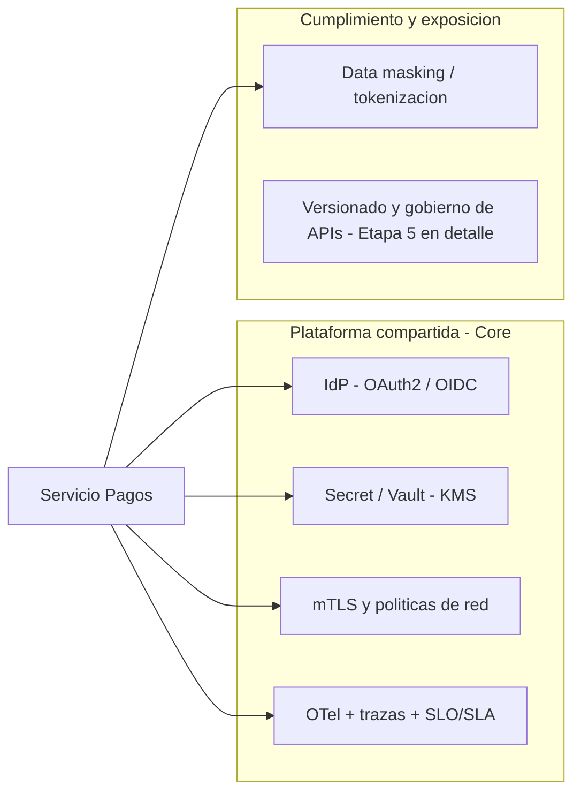
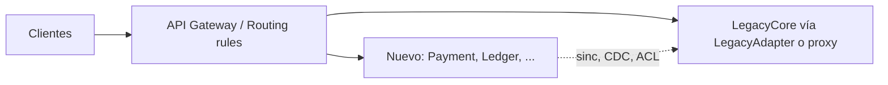
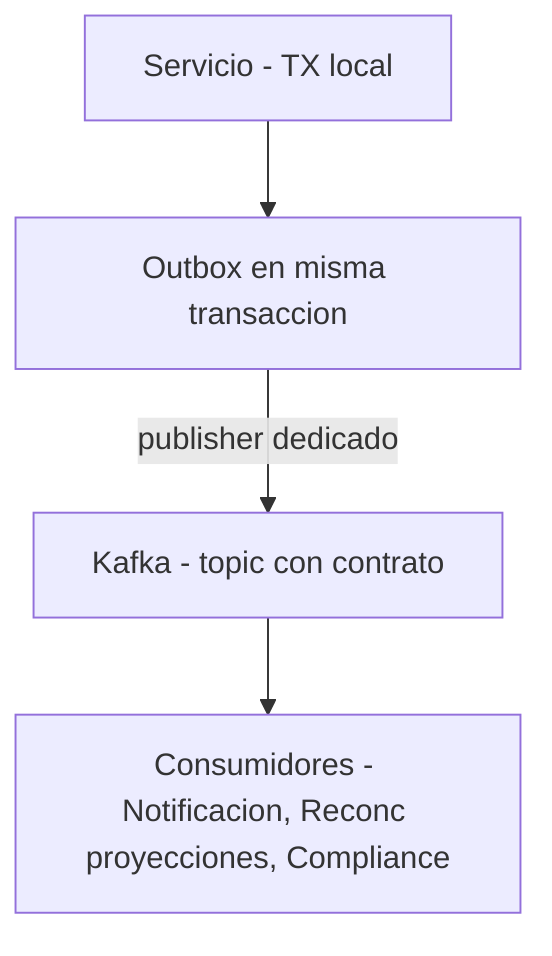
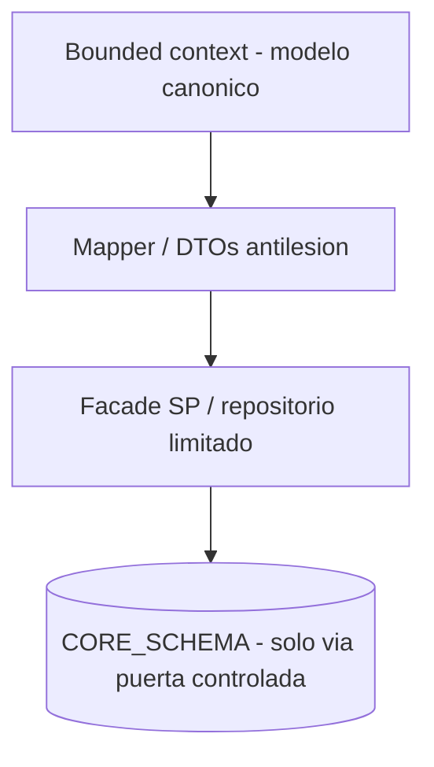

# Etapa 3: Diseno Tecnico (Arquitectura de Soluciones)

---

Esta etapa baja el diseno estrategico a componentes concretos. **C4** es una forma de explicar arquitectura por niveles: primero el sistema en su entorno, luego sus contenedores principales, despues sus componentes internos. **UML** aporta diagramas complementarios para despliegue, integracion y clases. La intencion es que arquitectura, desarrollo, operaciones y gerencia puedan ver la misma solucion con distinto nivel de detalle.

## 3.1 C4 - Nivel 1: Vista de contexto (System Context)

Actores y sistemas externos. GlobalLedger se muestra como producto; `LegacyCore` en transicion
bajo un borde de migracion (Strangler).



---

## 3.2 C4 - Nivel 2: Contenedores (Vista de contenedores)

Descomposicion logica: API edge, BFF por canal (opcional por fase), servicios alineados a bounded
contexts, bus de eventos, almacenamiento y adaptadores. En migracion, **no** toda carga pasa
solo por el monolito: el trafico puede enrutarse hacia contenedores nuevos detras de **API
Gateway** y reglas de **Strangler**.



---

## 3.3 C4 - Nivel 3: Componentes (un contenedor: Payment Orchestration)

Se elige el contenedor **mas critico** del core: orquesta pagos, coordina a FX, fraude, ledger y
clearing, y aplica SAGA con compensaciones.



---

## 3.4 UML - Vista de despliegue (Deployment)

Mapeo a runtime: Kubernetes en nube, zonas, servicios, broker y dependencias hibridas
(Kubernetes + HSM on-prem, Oracle legado mientras dure). Representacion con grafico de
**despliegue** (nodos = entornos de ejecucion, artefactos = contenedores).



**Notas**:
- **HSM** puede permanecer on-prem; los contenedores que requieran cifrado PIN/firma usan
  servicio criptografico con latencia acotada o Cloud HSM en fases posteriores.
- **Oracle** se aísla vía `LegacyAdapter` y, donde aplique, **CDC (Debezium) → Kafka** hacia
  proyecciones, sin reintroducir "shared database" en servicios target.

---

## 3.5 UML - Vista de integracion

Flujo de integracion entre componentes, incluyendo respaldo asincronico
a canales (polling/WebSocket) cuando el procesamiento deja de ser 200 OK inmediato.



**Puente "sync" vs "async"**: hoy el cliente puede esperar **200 inmediato**; el diseno
separa **aceptacion** (recepcion, validacion, idempotencia) de **liquidacion** (asincrona).
La respuesta al cliente refleja estado: `ACCEPTED` o `PENDING` + `correlationId` para
consulta.

---

## 3.6 UML - Vista de infraestructura (operacion)

Capa de plataforma compartida: identidad, secretos, observabilidad, malla de servicios y
requisitos de cumplimiento (cifrado en tránsito, segmentacion, auditoria de API).



| Servicio / Componente | Donde corre (compute) | Datos / almacenamiento | Comunicacion sincrona | Comunicacion asincrona | Seguridad (mTLS/red) | HA / escalado |
|-----------------------|-----------------------|------------------------|-----------------------|------------------------|----------------------|---------------|
| **Payment Orchestration** | Kubernetes (`deployment` multi-AZ) | PostgreSQL propio (`payment_orders`, `outbox`) | API Gateway/BFF, llamadas a FX/Fraud/Ledger/Clearing (HTTP/gRPC) | Publica eventos a Kafka (`PaymentAccepted`, `PaymentSettled`) | mTLS servicio-servicio, `NetworkPolicy` solo a dependencias permitidas | Replicas horizontales + HPA; sin estado en memoria |
| **Ledger Service** | Kubernetes (`deployment` dedicado) | PostgreSQL propio de ledger (asientos, cuentas, invariantes) | API interna para registrar/consultar asientos | Publica eventos (`LedgerEntryPosted`) y consume eventos de pago | mTLS obligatorio; acceso de red restringido a servicios autorizados | Replicas + failover de BD (Patroni o gestionada) |
| **Clearing Adapters** | Kubernetes (`deployment` por rail o modulo) | PostgreSQL liviano (tracking, retries, correlacion) | Llamadas a redes/bancos (ISO/API/H2H) y API de tracking interna | Consume ordenes de pago y publica estados (`Sent`, `Acked`, `Rejected`) | mTLS interno + secretos en Vault/KMS + egreso controlado a externos | Escalado por cola y por adaptador; reintentos idempotentes |
| **Fraud & Screening** | Kubernetes (`deployment` de baja latencia) | Motor/reglas + store transaccional propio | Evaluacion sincrona (<100ms p99) desde Payment | Consume features/eventos y publica alertas/veredictos | mTLS + segmentacion de red por dominio sensible | Autoscaling por CPU/latencia; aislamiento de carga (bulkheads) |
| **Reconciliation** | Kubernetes (`deployment` + jobs programados) | PostgreSQL/read models + archivos/extractos ingeridos | Query API a Ledger y, donde aplique, consulta a bancos | Consumo de eventos y emision de `ReconciliationMatch`/excepciones | mTLS interno; politicas de red para acceso solo a fuentes necesarias | Escalado por particion de lotes y ventanas operativas |
| **LegacyAdapter (ACL)** | Kubernetes (`deployment` aislado) | Sin modelo de dominio propio; mapeos + cache tecnico opcional | API controlada hacia Oracle/SP y fachada a servicios nuevos | CDC/publicacion de cambios legacy hacia Kafka (faseada) | Segmento de red dedicado; credenciales rotadas en Vault | Replicas acotadas; circuit breaker al legado para proteger el core |
| **Kafka (Event Bus)** | Cluster administrado o autogestionado multi-broker | Topics por dominio, DLQ, schemas | N/A (broker de eventos) | Backbone async entre servicios y proyecciones | TLS/mTLS + ACLs por topic + cifrado en reposo | Replicacion por particion, ISR, rebalanceo |
| **Plataforma compartida (`IdP`, `Vault/KMS`, `O11y`)** | Servicios gestionados o cluster plataforma | Secretos, llaves, metricas, trazas y logs | Authn/Authz, emision de tokens, lectura de secretos | Telemetria y eventos operativos | Politicas centralizadas de identidad y red; auditoria | Despliegue redundante y monitoreo con SLO/SLA |

---

## 3.7 Estilos y patrones arquitectonicos (seleccion y descartes)

| Estilo / patron | Uso en GlobalLedger | Drivers impactados (Etapa 1: KPIs de Negocio vs Metricas Tecnicas) |
|-----------------|---------------------|---------------------------------------------------------------------|
| **Microservicios / modulos desplegables** | Por contexto, con bordes claros | **Escalabilidad Extrema**; **Disponibilidad 99.999%**; **Modernizacion a Cloud Native**; **Resiliencia**. |
| **Event-Driven Architecture (Kafka)** | Dominio, integracion, analitica | **Escalabilidad Extrema**; **Disponibilidad 99.999%**; **Eliminacion batch nocturno**; **Gobierno de Datos (PCI-DSS/GDPR)**. |
| **SAGA (orquestada) en Payment** | Pago P2P multi-paso con compensacion | **Resiliencia**; **Disponibilidad 99.999%**; **Escalabilidad Extrema**. |
| **Outbox pattern** | Emision fiable a Kafka + orden | **Gobierno de Datos (PCI-DSS/GDPR)**; **Resiliencia**; **Escalabilidad Extrema**. |
| **Hexagonal / Clean en cada servicio** | Puertos, adaptadores, tests | **Modernizacion a Cloud Native**; **Resiliencia**; **Gobierno de Datos (PCI-DSS/GDPR)**. |
| **API Gateway (con BFF evolutivo)** | Borde, seguridad, throttling, routing | **Modernizacion a Cloud Native**; **Gobierno de Datos (PCI-DSS/GDPR)**; **Escalabilidad Extrema**; **Disponibilidad 99.999%**. |
| **Strangler (migracion progresiva)** | Reglas de ruteo + `LegacyAdapter`/ACL para mover trafico por fases sin big bang | **Modernizacion a Cloud Native**; **Disponibilidad 99.999%**; **Resiliencia**; **Gobierno de Datos (PCI-DSS/GDPR)** (cambios acotados y reversibles). |
| **CQRS (seleccivo)** | Vistas de tesoreria, reportes, proyecciones de reconciliacion | **Eliminacion batch nocturno**; **Escalabilidad Extrema**; **Disponibilidad 99.999%**. |
| **Circuit Breaker, Bulkhead, Timeouts, Retries (Resilience4j)** | LLamadas a fraude, redes, legado | **Resiliencia**; **Disponibilidad 99.999%**; **Escalabilidad Extrema**. |

| Opcion | Por que se **descarta** o se posterga (por ahora) |
|--------|--------------------------------------------------|
| **Nuevo monolito unico a largo plazo** | Choca con **Escalabilidad Extrema**, **Modernizacion a Cloud Native**, **Resiliencia** y **Disponibilidad 99.999%** (un solo despliegue y acoplamiento amplio). |
| **2PC/WS-AT** | Choca con **Escalabilidad Extrema** y **Disponibilidad 99.999%** (latencia y fragilidad operativa vs picos y SLAs). |
| **Pila reactiva pura (WebFlux) en *todos* los servicios** | Choca con **Modernizacion a Cloud Native** y **Resiliencia** en fase de migracion; se sustituye por **Virtual Threads** + I/O y async adecuado en bordes y mensajes. |
| **Shared database entre microservicios** (escritura compartida) | Choca con **Escalabilidad Extrema**, **Resiliencia** y **Gobierno de Datos (PCI-DSS/GDPR)**; solo tolerado en fase de **ACL/Oracle** bajo gobierno. |

---

## 3.8 Tres patrones de integracion mas significativos (con diagrama)

### 1) **Strangler + API Gateway (ruta de migracion)**

Ruta progresiva del trafico desde `LegacyCore` a servicios nuevos sin big bang.



**Drivers de arquitectura (Etapa 1) que este patron contribuye a cumplir**

- **Modernizacion a Cloud Native**: permite desplegar servicios nuevos por fases (sin apagar el
  mundo) y mover trafico de forma reversible con reglas en el **API Gateway**.
- **Disponibilidad 99.999%** y **Resiliencia**: el legado puede seguir respondiendo mientras el
  nuevo stack absorbe porcentajes crecientes de carga; si un modulo nuevo falla, el ruteo
  puede volver a **LegacyCore** como red de seguridad operativa (segun reglas acordadas).
- **Gobierno de Datos (PCI-DSS/GDPR)**: el borde unifica TLS/throttling/autenticacion y reduce
  superficies expuestas durante la transicion.
- **Escalabilidad Extrema**: al separar el trafico por capacidades, se puede escalar el nuevo
  contenedor sin forzar el mismo factor de escala en todo el monolito.
- **Multi-region + failover + desacoplamiento** (en conjunto con la estrategia de plataforma): el
  Strangler reduce el acoplamiento operativo entre nuevo stack y legado, que es un prerequisito
  para mover capacidades por region/AZ sin arrastrar todo el monolito en cada cambio.

**Como se logra en la practica (simple)**: primero se define el contrato estable en el borde
(API/events), luego se mueven endpoints/flujos **por porcentaje** o por **tipo de pago/corredor**,
siempre con observabilidad y feature flags; la coexistencia se gobierna con `LegacyAdapter`/ACL
para no contaminar el modelo canonico.

### 2) **Outbox + Kafka (integracion fiable y eventual)**



**Drivers de arquitectura (Etapa 1) que este patron contribuye a cumplir**

- **Arquitectura desacoplada + Virtual Threads + auto-scaling**: el core OLTP publica hechos sin
  acoplar sincronicamente a todos los consumidores; cada consumidor escala por su demanda.
- **Escalabilidad Extrema**: Kafka actua como buffer y fan-out para picos (notificaciones,
  proyecciones, compliance) sin convertir cada lectura analitica en carga directa sobre OLTP.
- **Eliminacion batch nocturno**: los consumidores pueden ir construyendo vistas y cruces de
  forma continua (streaming) en lugar de depender de ventanas batch para "enterarse" del mundo.
- **Gobierno de Datos (PCI-DSS/GDPR)**: el evento queda como registro auditable (contrato de
  topic/schema + trazas) y reduce publicaciones "fantasma" al combinarlo con **Outbox** en la
  misma transaccion local.
- **Trazabilidad total + cifrado + tokenizacion**: la trazabilidad se refuerza con un log de
  dominio auditable (eventos + correlacion); cifrado/tokenizacion siguen siendo responsabilidad
  transversal (borde, KMS/HSM, masking), pero el bus queda como cadena de evidencia operativa.
- **Resiliencia** y **Disponibilidad 99.999%**: si un consumidor cae, el log de eventos permite
  reprocesar/reintentar sin perder el mensaje de negocio (idempotencia en consumo).

**Como se logra en la practica (simple)**: en la misma TX del servicio se persiste el cambio de
negocio + fila **Outbox**; un publicador confiable envia a Kafka; los consumidores aplican efectos
secundarios con **idempotencia** (clave de negocio / deduplicacion).

### 3) **Anticorruption Layer (LegacyAdapter) a Oracle / SPs**



**Drivers de arquitectura (Etapa 1) que este patron contribuye a cumplir**

- **Modernizacion a Cloud Native**: permite evolucionar servicios nuevos sin reescribir Oracle de
  golpe, acotando el cambio a **fachadas** y contratos versionados.
- **Gobierno de Datos (PCI-DSS/GDPR)**: el acceso a `CORE_SCHEMA` queda **centralizado** (menos
  "SQL escondido" en apps), con auditoria y permisos mas controlables.
- **Resiliencia** y **Disponibilidad 99.999%**: el legado puede degradarse sin propagar su modelo
  fragil a todo el sistema; el ACL aisla timeouts/errores y permite circuitos/bulkheads en el
  borde controlado.
- **Circuit breaker + bulkhead + colas de reintento**: el `LegacyAdapter` es el lugar natural
  para aplicar estos mecanismos sin ensuciar el dominio canonico del servicio.
- **Escalabilidad Extrema**: reduce el acoplamiento accidental (menos joins implicitos y menos
  dependencias compartidas) que suele frenar el escalado independiente por servicio.

**Como se logra en la practica (simple)**: el bounded context trabaja con su **modelo canonico**;
solo el `LegacyAdapter` conoce tablas/SPs y traduce con mappers/DTOs; cualquier lectura/escritura
legacy pasa por una **puerta** (API interna/facade) con limites claros y pruebas de contrato.

---

## 3.9 Stack tecnologico (propuesta)

| Capa | Eleccion (propuesta) | Comentario |
|------|----------------------|------------|
| Runtime | **Java 25** + **Spring Boot 4** | Base unica para servicios, modulo por modulo. |
| API | **Spring Web (MVC) + Virtual Threads** en la mayoria de servicios | Concurrencia masiva I/O con modelo imperativo/hexagonal, menor friccion con legado. |
| Mensajeria | **Apache Kafka** (Pulsar aceptable) | Outbox, streaming, proyecciones, integracion asincrona. |
| Datos nuevos | **PostgreSQL** por servicio (sin escritura compartida) | OLTP; migrar Golden Record con estrategia por fase. |
| Datos legado | **Oracle (CORE_SCHEMA)** a traves de **LegacyAdapter** | Aislamiento, vistas de compatibilidad, CDC cuando aplique. |
| Resiliencia | **Resilience4j** | Circuit breaker, rate limit, retry con backoff, bulkhead. |
| Observabilidad | **OpenTelemetry** + back-end estandar (Prometheus, Grafana) | SLO, MTTR, trazas por `correlationId` / pago. |

**Por que no WebFlux "como stack unico"**: el objetivo de reactivos **no** es la sintaxis
`Mono` en todos los lados, sino **alta concurrencia I/O** y **asincronia** donde importa. En
**Java 21+**, Virtual Threads permiten sostener cientos de miles de operaciones I/O
concurrentes con programacion sencilla y con excelente alineacion con drivers bloqueantes y
fases de migracion. La **alta tasa y picos** se resuelven con **escala horizontal, particion
de colas, modelos de datos, y asincronia de dominio (Kafka)**, ademas de tuning concreto; no
solo con el estilo reactivo del framework web.

---

## 3.10 Estrategia de consistencia de datos

| Dominio / operacion | Consistencia | Mecanismo resumido |
|---------------------|--------------|---------------------|
| **Saldos y asientos (Ledger)** | **Fuerte (ACID) dentro del servicio** y por correlacion de negocio | Transaccion local, invariantes, sin saldo negativo, idempotencia por clave. |
| **Pago P2P multi-servicio** (FX + Ledger + Clearing) | **Saga (consistencia eventual con compensacion)** + estado explicito de orden | Pasos, timeouts, reintentos idempotentes, compensar debito/lock si falla red. |
| **Proyecciones, notificaciones, reportes, tesoreria read** | **Eventual** (segundos / minutos) | Outbox, Kafka, consumo idempotente, reconciliacion operativa. |
| **Canales: lectura "saldo en pantalla"** | **Lectura eventual aceptable** o lectura de **read model** optimizado, con criterio de SLO en Etapa 4+ | Alinea con QA-07; la verdad dura se consulta a Ledger bajo criterio de producto. |
| **Coexistencia con Oracle** | Fases: **fuentes de verdad duales bajo gobierno** hacia un **Golden Record** (CDC, ACL, reprocessing) | Evita divergencia silenciosa; requiere linaje (Etapa 5 en profundidad). |

---

## 3.11 Spec Driven Design para implementacion asistida por IA

Durante la implementacion se propone trabajar con **Spec Driven Design**: antes de generar codigo, cada flujo critico se expresa como una especificacion verificable. Esto permite aprovechar agentes de inteligencia artificial sin delegarles decisiones ambiguas de negocio.

Una especificacion debe incluir:

- **Contrato de entrada y salida**: API, evento o comando con campos, tipos, ejemplos y errores esperados.
- **Reglas de negocio**: invariantes que no pueden romperse, por ejemplo "un saldo no queda negativo" o "un pago no se procesa dos veces con la misma clave de idempotencia".
- **Estados permitidos**: transiciones validas del pago, por ejemplo `CREATED -> VALIDATED -> SENT -> SETTLED`.
- **Criterios de aceptacion**: casos que demuestran cuando la funcionalidad esta completa.
- **Pruebas base**: unitarias, de contrato y de integracion, para que el agente produzca codigo contra una expectativa medible.

**Ejemplo abreviado: especificacion antes de codigo**

Caso: aceptar una orden de pago P2P.

```text
Dado un cliente activo con saldo disponible de 100 USD
Y una solicitud con Idempotency-Key = "abc-123"
Cuando envia un pago de 25 USD a un beneficiario valido
Entonces Payment Orchestration crea una orden en estado ACCEPTED
Y registra una fila Outbox con el evento PaymentAccepted
Y si la misma solicitud se repite con la misma Idempotency-Key, retorna la misma orden sin duplicar el debito
```

Con esta especificacion, un agente de IA puede generar controladores, casos de uso, pruebas y adaptadores. El equipo humano conserva el control validando contratos, reglas e invariantes antes de aceptar el codigo.

