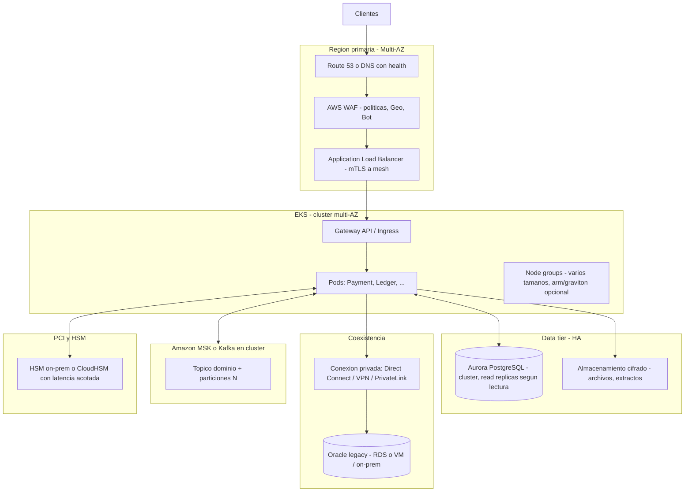
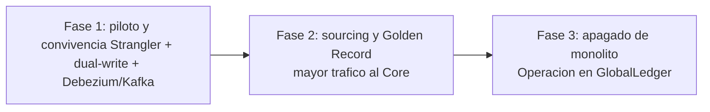
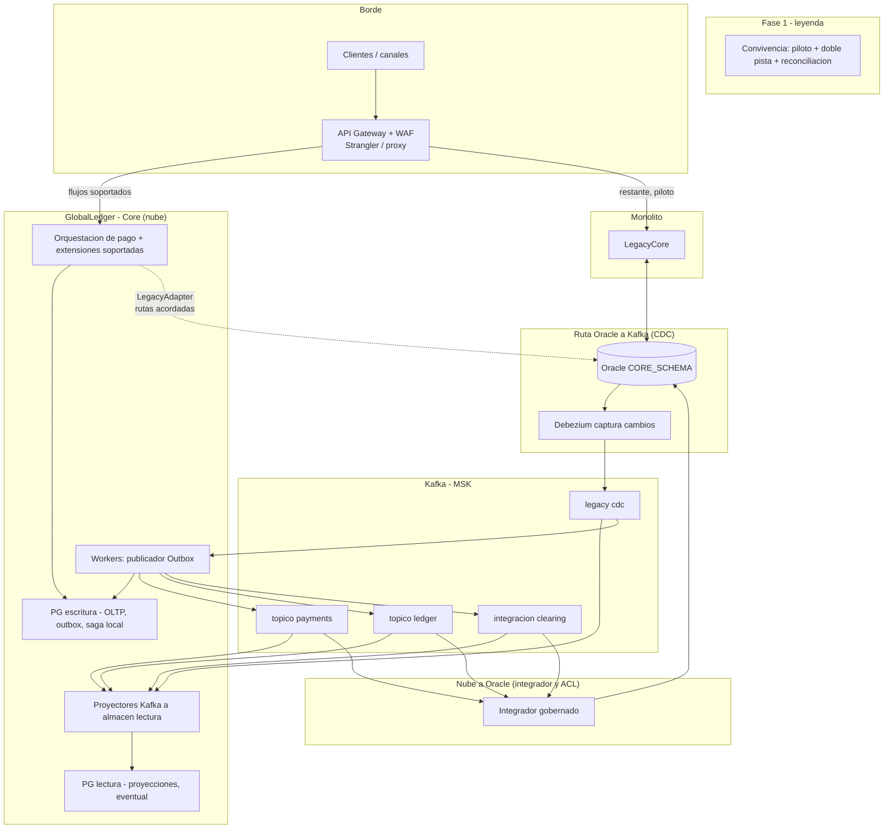
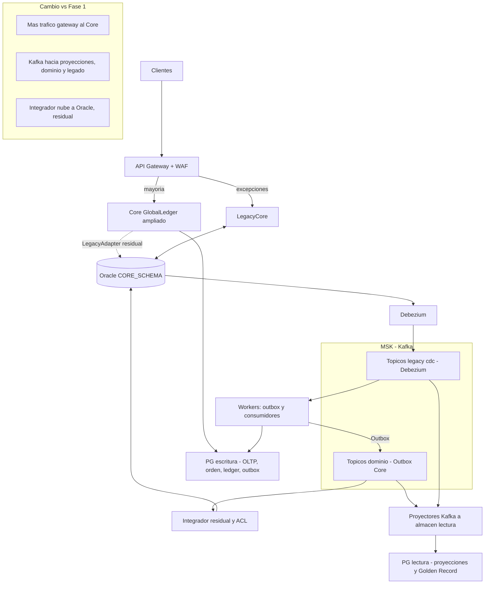
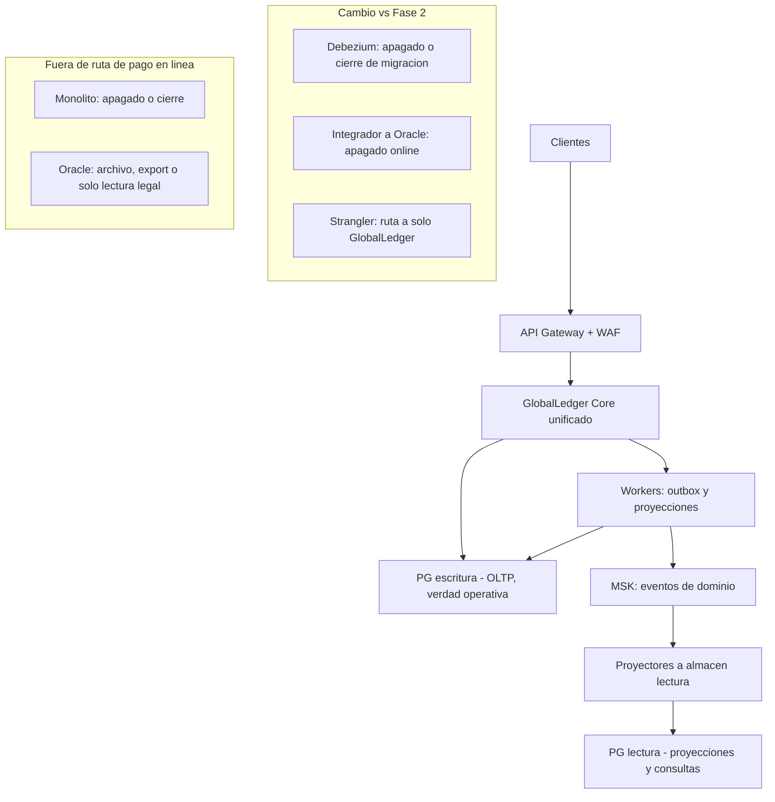

# Etapa 4: Infraestructura y Resiliencia

---

## 4.1 Arquitectura de referencia en nube (HA y auto-escalado)

### 4.1.1 Objetivo de plataforma

- **SLO/SLA de negocio**: el **SLO** es el objetivo interno de servicio y el **SLA** es el compromiso formal con clientes o negocio. Para esta kata se busca disponibilidad 99,999%, sin ventana de mantenimiento; absorcion de **picos** hacia 1M TPS en capa de eventos/borde con dimensionamiento adecuado; **RTO/RPO** acotados por categoria de pago. **RTO** es cuanto tiempo maximo se acepta para recuperar el servicio; **RPO** es cuanta perdida de datos se tolera.

- **Separacion de fronteras**: borde (Web App Firewall o **WAF**, APIs y limites de uso), plano de datos transaccionales (**OLTP**, procesamiento de operaciones de negocio), **streaming** (Kafka), **legado** (Oracle) y **perimetro criptografico HSM/PCI** (hibrido).

---

## 4.2 Patrones de resiliencia (tacticas y donde aplican)

### 4.2.1 Mapa driver → tactica

| Driver / atributo | Tacticas concretas |
|--------------------------|-------------------|
| **Disponibilidad 99,999%** | Health checks agresivos, excluir carga en nodos no sanos, **DLQ** (cola de mensajes fallidos en Kafka). |
| **"Red SWIFT cae, no pierdo pago"** (QA-05) | **Timeout** + **retry** con idempotencia; **almacenamiento** de intencion con estado; **reproceso** y alertas. |
| **"Operacion 24/7"** (sin read-only 02:00-04:00) | Procesos **asincronicos** y **reconciliacion** sin full scan bloqueante (diseñado en Etapa 1/2/3). |

### 4.2.2 Con Resilience4j (alineado a `Etapa3_Diseno_tecnico.md`)

| Proteccion | Aplicacion tipica | Razon no alcanzar 99% por falla en tercero |
|------------|-------------------|---------------------------------------------|
| **TimeLimiter** | Llamada a fraude, clearing, banco | Corte p99, circuito, degradacion. |
| **Retry** | Reintentar solo operaciones idempotentes | No duplicar pago. |
| **CircuitBreaker** | Banco, red, KYC, legado inestable | Aisla una falla activa, evita saturar hilos y protege al resto del sistema. |

---

## 4.3 Roadmap de migracion: Strangler Fig (por fases, texto + diagrama)

Estrategia de conjunto: **tres fases** sin *big bang*, con **criterios de corte** entre una y
otra.

**Vista de conjunto (una linea):**

### Fase 1 — Piloto, dual-write y convivencia con Oracle (Debezium + Kafka)

La estrategia es que **los canales (app, web, partners)** mantengan la misma experiencia. 
El ingreso pasa por un **borde** (por ejemplo **API Gateway con WAF**), El **proxy del Strangler** reenvia al **Core** solo los flujos **ya soportados**; el **resto** sigue al **LegacyCore**.

**CDC (Oracle → nube):** **Debezium** toma el **cambio continuo** de Oracle y publica en
**Kafka** (por ejemplo `legacy.cdc.*`); asi el Core o los **workers** reaccionan **sin** consultas
masivas al monolito. La vuelta **nube → Oracle** va por un **integrador gobernado** (ACL, NiFi o
jobs), no por SQL disperso en canales.

*Dos PostgreSQL (logico): **escritura (OLTP)** = verdad inmediata del corte, transaccional; **lectura
(proyecciones)** = vistas/eventual, alimentada por **Kafka** (aun al inicio pueda ser pequeña). En
carpeta de despliegue puede ser un mismo motor con instancias o esquemas distintos.*

**Diagrama — Fase 1 (posicion de Debezium: Oracle → Debezium → Kafka; Outbox hacia topicos de
dominio; dos motores de datos de rol distinto):**

| Criterio de corte hacia Fase 2 (ejemplos) |
|------------------------------------------|
| Piloto estable (error rate, p99); reconciliacion diaria OK; rollback demostrado en **gateway**; cartera creciente hacia el Core. |

### Fase 2 — Sourcing: mas trafico al Core, Golden Record y proyecciones (cambio vs Fase 1)

**Cambio en negocio (vs Fase 1).** El **Strangler** enruta la **mayoria** del trafico al **Core**;
`LegacyCore` queda **solo** para excepciones o producto aun no migrado. La **doble escritura hacia Oracle**
se acota a **dominios puntuales** bajo contrato, no a todo el catalogo.

**Cambio en datos (vs Fase 1).** El segundo PostgreSQL (**proyecciones / Golden Record**) se
alimenta desde **Kafka** con **dos vias** (no desde Oracle “como origen unico”): (1) **eventos de
dominio** que el **Core** publica de forma fiable (via **Outbox** en workers) a topicos
`payments.*` / `ledger.*`, y (2) **cambios del legado** con **Debezium → Kafka** en `legacy.cdc.*`.
**Consumidores de proyeccion** materializan en el almacen de **lectura eventual** (GR) para
reconciliacion, busquedas y reporte sin someter al **OLTP** a analitica pesada. **Orden y ledger**
sigue en el **PG de escritura** (verdad del flujo migrado); el **PG de lectura** es el de
proyecciones. Hacia Oracle solo puentes **residuales** con paridad acordada. *Misma logica de dos
PostgreSQL de rol distinto que en Fase 1; aqui el almacen de lectura se usa con mas intensidad.*

**Diagrama — Fase 2 (GR alimentada por Kafka: dominio desde el Core + CDC; integrador residual a
Oracle; dos PG escritura y lectura):**

| Criterio de corte hacia Fase 3 (ejemplos) |
|------------------------------------------|
| Volumen mayoritario o critico en nube; Oracle aislado en pocos modulos; paridad verificada; RTO/RPO probados; coste operativo aceptable. |

### Fase 3 — Apagado de monolito y Oracle en operacion (cambio vs Fase 2)

**Cambio en negocio (vs Fase 2).** **Canales y APIs** descansan en **casi o todo** en GlobalLedger. Se
**corta** el ruteo de **negocio** al `LegacyCore` y la **doble escritura online** a Oracle en
**operacion diaria**; Oracle pasa a **archivo, export o base historica** (gobierno en Etapa 5).

**Cambio en arquitectura (vs Fase 2).** **Debezium** e **integrador nube→Oracle** quedan
**apagados** o **solo cierre** de migracion. Kafka mantiene **eventos de dominio**; no se opera el
**dia a dia** contra `legacy.cdc` para sostener producto. El **doble almacen** (escritura vs
lectura) **se mantiene**: la **verdad operativa** sigue en el **OLTP**; **proyecciones** en el
**PG de lectura**, alimentado por eventos de dominio (sin mezclar responsabilidades en un solo
esquema confuso).

**Diagrama — Fase 3 (ruta de negocio solo a GlobalLedger; dos PG; legado y Oracle fuera de
operacion online o solo historico):**

| Riesgo | Mitigacion |
|--------|------------|
| Corte al cerrar fase | Freeze de esquemas, reconciliacion final, reprocessing, paridad de producto. |
| Inconsistencia pago-ledger en el corte | SAGA, idempotencia, runbooks, monitoreo. |
| Retencion y evidencias (Oracle) | Estrategia de archivo, compliance (Etapa 5). |
| Organizacion | Conway, operacion y documentacion unificadas. |

### Ejemplo simple de migracion progresiva

Supongamos que FinScale empieza con pagos P2P entre USD y EUR:

1. En Fase 1, solo el 5% de esos pagos entra por `GlobalLedger`; el 95% sigue en `LegacyCore`.
2. Si durante el piloto hay diferencias de conciliacion, el API Gateway devuelve ese corredor al legado y el equipo corrige sin detener toda la operacion.
3. Cuando el error rate, la latencia p99 y la conciliacion diaria cumplen el criterio de corte, el porcentaje sube a 25%, luego 50% y despues mayoria.
4. En Fase 3, ese flujo ya no consulta Oracle en linea; Oracle queda como archivo historico o evidencia legal.

