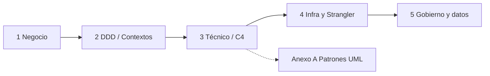

# FinScale Evolution - Architectural Kata

## Resumen

Kata de arquitectura (**FinScale** -> plataforma **GlobalLedger**): fintech con un sistema heredado centralizado que debe evolucionar sin detener el negocio. La solución busca soportar picos de **1M TPS** (un millón de transacciones por segundo), operación **24/7** y una migración progresiva tipo **Strangler** (reemplazar partes del sistema antiguo por servicios nuevos, por etapas).

El documento sigue **Why Driven Design (WhyDD)**: partir del "por qué" de negocio antes de elegir tecnología. La ruta es: *Entender -> Diseñar estratégicamente -> Diseñar técnicamente -> Evaluar*. Además, en la implementación se propone usar **Spec Driven Design** (diseño guiado por especificaciones): antes de pedir código a agentes de inteligencia artificial, se escriben contratos, reglas, ejemplos y criterios de aceptación para que el resultado sea verificable y menos ambiguo.

---

- **Síntesis de stack** acordada en el diseño: **Java 25**, **Spring Boot 4**, **Spring Web MVC con Virtual Threads** (hilos livianos para manejar muchas operaciones de entrada/salida), desacoplamiento con **Kafka** dentro de una **arquitectura orientada a eventos**; consistencia estricta en **Ledger** (libro contable), **SAGA** (coordinación de procesos distribuidos con compensaciones) y **proyecciones** donde aplica. Detalle: [Etapa3 - Stack y consistencia](Etapa3_Diseno_tecnico.md#39-stack-tecnologico-propuesta).

---

## Glosario ejecutivo

| Concepto | Significado en esta kata |
|----------|--------------------------|
| **TPS** | Transacciones por segundo. Sirve para medir la capacidad de procesamiento. |
| **Legacy / LegacyCore** | Sistema heredado que aún sostiene el negocio, pero limita la evolución. |
| **Strangler** | Estrategia de migración gradual: el sistema nuevo va absorbiendo funciones del antiguo hasta reemplazarlo. |
| **DDD / Bounded Context** | Diseño guiado por dominio. Un *bounded context* es una frontera clara donde un equipo maneja su propio modelo de negocio. |
| **C4** | Forma de documentar arquitectura en niveles: contexto, contenedores, componentes y código. |
| **API Gateway** | Puerta de entrada que aplica seguridad, límites de uso y enrutamiento hacia servicios. |
| **Kafka / Event-Driven Architecture** | Kafka es una plataforma de eventos; la arquitectura orientada a eventos comunica servicios mediante hechos publicados, no solo llamadas directas. |
| **Outbox** | Patrón que guarda el cambio de negocio y el evento en la misma transacción para evitar mensajes perdidos. |
| **ACL / Anti-Corruption Layer** | Capa que traduce entre el modelo nuevo y el sistema antiguo para que el legado no contamine el diseño moderno. |
| **HSM** | Hardware Security Module: equipo especializado para custodiar llaves criptográficas. |
| **SLO / SLA / RTO / RPO** | Objetivos y acuerdos de servicio, tiempo máximo de recuperación y pérdida máxima aceptable de datos. |
| **PII / PCI-DSS / GDPR** | Datos personales y regulaciones de seguridad y privacidad aplicables a pagos y datos de clientes. |
| **Spec Driven Design** | Implementar a partir de especificaciones claras: contratos, ejemplos, reglas y pruebas antes del código. Es especialmente útil cuando se usan agentes de IA. |

---

## Etapas del documento (navegación)

Cada enlace abre el artefacto completo (con diagramas y tablas).

| Etapa | Archivo | Qué verás en breve |
|-------|---------|--------------------|
| **1** | [**Etapa1_Negocio.md**](Etapa1_Negocio.md) | Contexto, diagrama de componentes AS-IS, *Domain Storytelling* (P2P + reconciliación), **drivers de arquitectura**, atributos de calidad, **mapa de capacidades TOGAF** y ejemplos de impacto. |
| **2** | [**Etapa2_Diseno_estrategico.md**](Etapa2_Diseno_estrategico.md) | **Core domain chart**, **modelo de dominio** (clases), **bounded contexts**, **context map** (Customer-Supplier, ACL, Conformist) y **Conway inversa** (organización de equipos). |
| **3** | [**Etapa3_Diseno_tecnico.md**](Etapa3_Diseno_tecnico.md) | Vistas **C4** (contexto, contenedores, componentes), **UML** (despliegue, integración, infraestructura), estilos/patrones, **3 patrones de integración** (Strangler+Gateway, Outbox+Kafka, ACL), **stack**, **consistencia** fuerte vs eventual y **Spec Driven Design** para implementación asistida por IA. |
| **4** | [**Etapa4_Infraestructura.md**](Etapa4_Infraestructura.md) | Arquitectura de referencia en nube (ej. **AWS**), **HA / autoescalado**, resiliencia (HPA, circuitos, *bulkhead*, SRE), **Strangler en 3 fases** con riesgos y criterios de corte. |
| **5** | [**Etapa5_Gobierno.md**](Etapa5_Gobierno.md) | **ATAM** (tres riesgos y mitigaciones), **políticas de gobierno de API**, **data governance** (calidad, PII, **lineaje** en arquitectura *event-driven*). |

---

## Anexo A

| Documento | Contenido |
|-----------|-----------|
| [**AnexoA_Motor_Dispersion_Masiva.md**](AnexoA_Motor_Dispersion_Masiva.md) | *MassPaymentProcessor*: **diagrama de clases** UML y seis patrones (Builder+Prototype, Flyweight, Chain of Responsibility, State, Bridge, Observer) con **justificaciones** para 500K instrucciones/ lote. |

---

## Conclusión final

La arquitectura propuesta trata a **GlobalLedger** como plataforma de producto, no como “un microservicio más”: se parte del dolor de **acoplamiento, Oracle como hub único, batch bloqueante y time-to-market** y se responde con un camino de **migración evolutiva (Strangler)**.

En **negocio (Etapa 1)** se fijan drivers de escala, disponibilidad, cumplimiento y **mapa de capacidades**; el foco de transformación cae en pagos, *ledger*, fraude y canales, reduciendo lo que es *commodity*.

En **diseño estratégico (Etapa 2)** el dominio se descompone en **contextos acotados** con un **mapa** explícito (p. ej. *Payment Orchestration* vs *Ledger* vs *Fraud* vs *LegacyAdapter*), de modo que los equipos (Conway) pueden dueñar modelos y despliegues.

En **diseño técnico (Etapa 3)** la puesta a tierra es **C4/UML**: borde, servicios, Kafka, **SAGA** hacia múltiples *upstream*, **outbox** para fidelidad de eventos, **ACL** al *legacy*. El stack **Java 25 + Spring Boot 4 + Web + Virtual Threads** acerca la complejidad cognitiva al monolito actual, mientras la asincronía y el escalado de picos viven en **messaging**, particionamiento y **escala horizontal** donde aplica, sin imponer WebFlux en todo el ecosistema.

En **infraestructura (Etapa 4)** la nube aporta **Multi-AZ**, **autoscaling** (pods y nodos) y *patterns* de resiliencia acordes a 99,999% y terceros inestables; el **Strangler** en fases fija riesgo de *dual-write* y “golden record” con criterios de corte y reconciliación.

En **gobierno (Etapa 5)** se exige cierre de riesgo (**ATAM**), **APIs** versionadas e identificables, y **gobierno de datos** con lineaje y calidad, sin los cuales un sistema distribuido pasa de ser “moderno” a “no auditable”.

El **Anexo A** aterriza el razonamiento a código de plataforma de **alto volumen en batch**: *flyweight* y *plantilla* atacan memoria, **estado** y **cadena** controlan el ciclo y la validación, **puente** y **observador** mantienen el *core* extensible a redes y a contabilidad/notificaciones. En conjunto, el repositorio es una **línea de diseño coherente** de FinScale: del **por qué** al **cómo**, y del **cómo** a la **explotación** segura bajo riesgo real de fintech y regulación.

